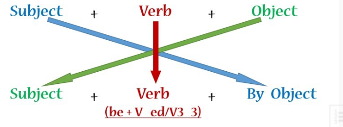
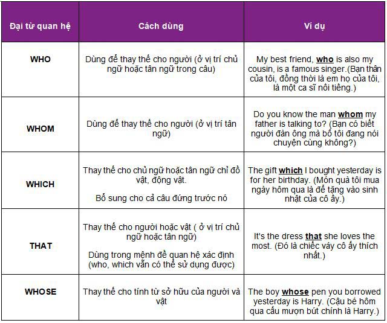
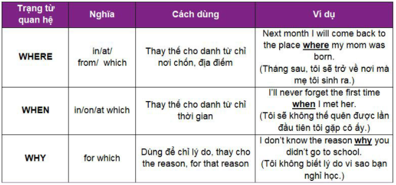

# Ngữ pháp

# [1. CÂU TƯỜNG THUẬT (REPORTED SPEECH)](#a)
## [1.1 Khái niệm câu tường thuật là gì?:](#a1)
## [1.2 Các bước chuyển từ câu trực tiếp sang câu tường thuật:](#a2)
## [1.3 Các loại câu tường thuật thông thường:](#a3)
## [1.4 Câu tường thuật dạng đặc biệt: ](#a4)
## [1.5 Một số bài tập vận dụng về câu tường thuật kèm đáp án:](#a5)
#

# [2. PASSIVE VOICE (CÂU BỊ ĐỘNG) ](#b)
## [2.1 Passive voice (câu bị động) là gì?](#b1)
## [2.2 Chuyển đổi câu chủ động (passive voice) sang câu bị động trong thì tiếng Anh (Tense)](#b2)
## [2.3 Các dạng trong câu bị động](#b3)
## [2.4 Các bước chuyển đổi từ câu chủ động sang câu bị động](#b4)
## [2.5 Bài tập về câu bị động (passive voice)](#b5)
#

# [3. CÁC LOẠI CÂU ĐIỀU KIỆN](#c)
## [3.1 Câu Điều Kiện là gì?](#c1)
## [3.2 Các loại câu điều kiện trong tiếng Anh:](#c2)
## [3.3 Các trường hợp khác trong câu Điều Kiện:](#c3)
## [3.4 Bài tập vận dụng](#c4)
#

# [4. GERUND (DANH ĐỘNG TỪ) VÀ INFINITIVES (ĐỘNG TỪ NGUYÊN MẪU)](#d)
## [4.1 Tổng quan về Gerund (Danh động từ) và Infinitives (Động từ nguyên mẫu)](#d1)
## [4.2 GERUND – Danh động từ (-ING FORM)](#d2)
## [4.3 INFINITIVES – Động từ nguyên mẫu](#d3)
## [4.4 Khi nào dùng Gerund (Danh động từ) và khi nào dùng Infinitives (Động từ nguyên mẫu)](#d4)
## [4.5 Bài tập về Gerund và Infinitives](#d5)
#

# [5. MỆNH ĐỀ QUAN HỆ (RELATIVE CLAUSES)](#e)
## [5.1 Định nghĩa mệnh đề quan hệ](#e1)
## [5.2 Các loại mệnh đề quan hệ](#e2)
## [5.3 Đại từ quan hệ (Relative Pronouns)](#e3)
## [5.4 Trạng từ quan hệ:](#e4)
## [5.5 Mệnh đề quan hệ rút gọn](#e5)
## [5.6 Lưu ý trong mệnh đề quan hệ](#e6)
## [5.7 Các trường hợp bắt buộc phải dùng THAT chứ không dùng WHICH](#e7)
## [5.8 Bài tập củng cố kiến thức (có đáp án)](#e8)
#

# [6. MODAL VERB – ĐỘNG TỪ KHIẾM KHUYẾT](#f)
## [6.1 Phần 1 - Modal verbs](#f11)
### [6.1.1 Modal verbs là gì?](#f11)
### [6.1.2 Những modal verb thông dụng](#f12)
### [6.1.3 Modal verbs – Động từ khiếm khuyết have to – Must – Need to](#f13)
### [6.1.4 Modal verbs – Động từ khiếm khuyết may – might](#f14)
### [6.1.5 Modal verbs – Động từ khiếm khuyết need not](#f15)
### [6.1.6 Modal verbs – Động từ khiếm khuyết will](#f16)
### [6.1.7 Modal verbs – Động từ khiếm khuyết would](#f17)
### [6.1.8 Modal verbs – Động từ khiếm khuyết shall](#f18)
### [6.1.9 Modal verbs – Động từ khiếm khuyết should/ought to](#f19)
### [6.1.10 Modal verbs – Động từ khiếm khuyết had better](#f110)
### [6.1.11 Modal verbs – Động từ khiếm khuyết used to](#f111)
### [6.2 Phần 2 -Công thức của Modal verbs](#f2)
### [6.2.1 Các modal verbs – động từ khiếm khuyết hay gặp:](#f21)
### [6.2.2 Modal verbs – Động từ khiếm khuyết could](#f22)
### [6.2.3 Modal verbs – Động từ khiếm khuyết may / might](#f23)
### [6.2.4 Modal verbs – Động từ khiếm khuyết must / mustn’tmust + V1 (phải), diễn tả](#f24)
### [6.2.5 Modal verbs – Động từ khiếm khuyết needn’t + V1 = don’t / doesn’t have to + V1](#f25)
### [6.2.6 Sự khác nhau giữa must và have to trong modal verbs](#26)
### [6.2.7 Modal verbs – Động từ khiếm khuyết should](#f27)
### [6.2.8 Ought to + V1 (nên) / ought not to + V1 (không nên), diễn tả:](#f28)
### [6.2.9 Modal verbs – Động từ khiếm khuyết had better + V1 (nên, tốt hơn) / had better not + V1 (không nên)](#f29)
### [6.2.10 Modal verbs – Động từ khiếm khuyết used to + V1: đã từng](#f210)
## [6.3 Phần 3 – Phân loại Modal verbs](#f3)
### [6.3.1 Modal verbs – Động từ khiếm khuyết can/ could: có thể.](#f31)
### [6.3.2 Modal verbs – Động từ khiếm khuyết may/might: có thể.](#f32)
### [6.3.3 Modal verbs – Động từ khiếm khuyết should/ought to: nên.](#f33)
### [6.3.4 Modal verbs – Động từ khiếm khuyết must/have to: phải.](#f34)
### [6.3.5 Modal verbs – Động từ khiếm khuyết will/be going to: sẽ.](#f35)
## [6.4 BÀI TẬP THỰC HÀNH](#f4)
#

# [7. SO SÁNH HƠN VÀ SO SÁNH NHẤT](#g)
## [7.1 Các loại tính từ, trạng từ trong câu so sánh tiếng Anh](#g1)
## [7.2 Cấu trúc câu so sánh hơn trong tiếng Anh](#g2)
## [7.3 Cấu trúc câu so sánh hơn trong tiếng Anh](#g3)
## [7.4 Một số quy tắc về việc tạo nên các tính từ so sánh hơn và so sánh nhất](#g4)
## [7.5 Bài luyện tập](#g5)
#

# [8. Cụm động từ (Phrasal verb)](#h)
#

# <a id="a"></a> 1. CÂU TƯỜNG THUẬT (REPORTED SPEECH

## <a id="a1"></a>1.1 Khái niệm câu tường thuật là gì?:

Câu tường thuật (Câu gián tiếp) được định nghĩa là một loại câu cơ bản dùng để thuật lại một sự <br> việc, hay là một lời nói của ai đó. Hay nói cách khác, việc sử dụng câu tường thuật là biến <br> đổi câu nói trực tiếp sang gián tiếp. Loại câu tường thuật này bạn sẽ thường xuyên gặp trong <br> cuộc sống hàng ngày hoặc các bài phát biểu.

**E.g: Nam said he wanted to live in Ha Noi.**

## <a id="a2"></a></a>1.2 Các bước chuyển từ câu trực tiếp sang câu tường thuật:

**Bước 1: Chọn động từ tường thuật:**

Có rất nhiều động từ tường thuật trong tiếng Anh, như là:

|    Từ vựng    |    Tiếng Việt
| ------------- | --------------
|    Told, ask	|    Nói
|    Asked	    |    Yêu cầu
|    Denied	    |    Phủ nhận
|    Promised	  |    Hứa
|    Suggest	  |    Đề nghị, gợi ý

Tuy vậy, chúng ta thường chỉ dùng told, said và asked, lần lượt là động từ ở dạng quá khứ của <br> tell, say, ask. Ở đây WISE ENGLISH lưu ý các bạn cần phân biệt được cách dùng của told và said.

**E.g: Manh told Quynh that….** (Mạnh nói với Quỳnh rằng…) <br>
**→ Manh said that….** (Mạnh nói rằng…)

Nhìn vào ví dụ trên, ta thấy rằng, khi dùng told, bắt buộc phải tường thuật lại rằng Mạnh đang nói <br> với một đối tượng khác là Quỳnh. Còn động từ said được dùng khi chúng ta không muốn nhắc đến <br> đối tượng Quỳnh trong câu tường thuật. Ngoài ra, chúng ta có thể lược bỏ that trong câu tường <br> thuật mà không làm giảm ý nghĩa của câu.

**Bước 2: Đổi thì cho động từ:**
Khi chuyển từ câu trực tiếp sang câu tường thuật, chúng ta cần lùi thì cho động từ. Quy tắc lùi thì như sau:

|    Câu trực tiếp                    |    Câu gián tiếp
| ------------------------------------| ------------------
| Thì hiện tại đơn: S+V( s/es)	      | Thì quá khứ đơn: S+V(ed)
| Thì hiện tại tiếp diễn :            | Thì quá khứ tiếp diễn: 
| S+ am/is/are+ V-ing	                | S+ was/were + V-ing
| Thì hiện tại hoàn thành:            | Thì quá khứ hoàn thành: 
| S+have/has + PII	                  | S+had+ PII
| Thì hiện tại hoàn thành tiếp diễn:  | Thì quá khứ hoàn thành tiếp diễn: 
| S+ have/has + been + V-ing	        | S + had + been+ V-ing
| Thì quá khứ đơn: S+V(ed)	          | Thì quá khứ hoàn thành: S+had+PII
| Thì quá khứ tiếp diễn:              | Thì quá khứ hoàn thành tiếp diễn:
| S+was/were/was + V-ing	            | S+had+been+V-ing

**Một số lưu ý**

Lưu ý 1: 

Trong một số trường hợp, phải giữ nguyên thì của động từ bởi vì không thể lùi thì được nữa( trường <br> hợp động từ ở câu trực tiếp đang ở thì quá khứ hoàn thành tiếp diễn), hoặc khi nói lại chân <br> lý hay là sự thật hiển nhiên.

E.g: Khanh said: “The sun rises in the East”

→ Khanh told me that the sun rises in the East.

Lưu ý 2: 

Những động từ khiếm khuyết sau đây khi chuyển sang câu tường thuật thì không có sự thay đổi:

|    Từ vựng    |    Tiếng Việt
| ------------- | ---------
| Would	        | Sẽ
| Could	        | Có thể
| Might	        | Có lẽ
| Should	      | Nên
| Ought to	    | Phải

**Bước 3: Đổi lại các đại từ và tính từ sở hữu:**

Khi chuyển từ câu trực tiếp sang câu tường thuật chúng ta cần thay đổi các đại từ và tính từ sở <br> hữu theo quy tắc như sau:


|    Phân Loại câu    |    Trong câu trực tiếp    |    Trong câu tường thuật
| ------------------- | ------------------------- | --------------------------
|    Tân ngữ	        |    Me	                    |    Him, her
|                     |    Us    	                |    Them
|                     |    You	                  |    Me, us
|    Tính từ sở hữu	  |    My	                    |    His, Her
|                     |    Our	                  |    Their
|                     |    Your	                  |    Mine, Our
|    Đại từ sở hữu	  |    Mine	                  |    His, her
|                     |    Ours	                  |    Theirs
|                     |    Yours	                |    Mine, Ours
|    Đại từ nhân xưng |	   I	                    |    He, She
|                     |    We	                    |    They
|                     |    You	                  |    I, We

E.g: Minh told Vuong: “ I’m busy today, so i can’t play football with you”

→ Minh told Vuong that he was busy, so he couldn’t play football with him.

Ở Ví dụ trên, ta thấy rằng, trong câu trực tiếp, Minh nói với Vuong rằng “Hôm nay mình bận, mình <br> không thể đi đá bóng cùng cậu được”. Mình ở đây chỉ Minh, cậu ở đây chỉ Vuong. Cho nên khi <br> chuyển về câu tường thuật “mình” chuyển thành đại từ chỉ Minh là he, “cậu” chuyển thành đại <br> từ chỉ Vuong là him.

**Bước 4: Đổi các từ chỉ thời gian, nơi chốn:**

Khi tường thuật lại lời nói của một ai đó, chúng ta đã không còn ở thời gian, địa điểm đó nữa. Cho <br> nên khi chuyển từ câu trực tiếp sang câu tường thuật, các bạn cần thay đổi các từ chỉ địa <br> điểm, thời gian.

WISE ENGLISH xin gửi đến các bạn cách chuyển các trạng từ chỉ thời gian, địa điểm cụ thể như sau:

**Cách chuyển trạng từ chỉ địa điểm (nơi chốn):**


|    Câu trực tiếp    |    Câu gián tiếp
|    This	            |    That
|    These	          |    Those
|    Here	            |    There

**Cách chuyển trạng từ chỉ thời gian:**


|    Câu trực tiếp                |    Câu gián tiếp
| -----------------------         | ------------
|    Now	                        |    Then
|    Today	                      |    That day
|    Yesterday	                  |    The day before/ The previous day
|    The day before yesterday	    |    Two days before
|    Tomorrow	                    |    The day after/ The next day
|    Ago	                        |    Before
|    This Week	                  |    That Week
|    Last Week	                  |    The Week before/The previous Week
|    Last night	                  |    The night before
|    Next week	                  |    The week after/ The following week

## <a id="a3"></a> 1.3 Các loại câu tường thuật thông thường:

**1. Câu tường thuật thông thường:**

Cấu trúc: 
```sh
  S+ say/said + (that)+S+V

  says/ say to + O → Tells/tell+O

  Said to + O → Told + O
```

E.g: Ngoc said to Lan “ I haven’t finished my homework”.

→ Ngoc told Lan She hadn’t finished her homework.

**2. Câu tường thuật cho câu hỏi:**

**Câu hỏi Yes/No (Yes/No question):**

Cấu trúc: 
```sh
  S + Asked (+O) /Wondered/ Wanted/ Wanted to know  +  If/Whether + S+ V
```

E.g: “Are you fine?” Vang said.

→  Vang asked if/whether I was fine.

Chú ý: 

Khi tường thuật câu hỏi Yes/No các bạn phải chuyển từ câu hỏi trực tiếp sang dạng khẳng định, sau <br> đó thực hiện thay đổi thì, các trạng từ chỉ thời gian, nơi chốn, chủ ngữ, tân ngữ, đại từ sở <br> hữu, đại từ chỉ định sao cho hợp lý.

```sh
  Said to + O → Asked + O

  Says/ say to + O → Asks/ Ask +O
```

E.g: Ngan said to me: “ Have you been to Sai Gon?”

→ Ngan asked me if/whether I had been to Sai Gon.

**Câu hỏi có từ để hỏi (Wh- question):**

Cấu trúc: 
```sh
  S +   Asked (+O)+ Wondered +Wanted to know + Wh-Words + S+ V
```

E.g: Lan asked me “ where are you going on vacation.

→ Lan asked me where I was going on vacation.

```sh
  Said to + O → Asked + O

  Says/ say to + O → Asks/ Ask +O
```

E.g:

Phong said to me “ Who are you reading to?”

→ Phong asked me Who I was reading to.

**3. Câu tường thuật dạng mệnh lệnh:**

**Tường thuật dạng câu mệnh lệnh khẳng định:**

Cấu trúc:
```sh
  S + told + O + to- infinitive
```

E.g: “Please wait for me here, Lan”. Diep said.

→ Diep told Lan to wait for him there.

**Tường thuật dạng câu mệnh lệnh phủ định:**

Cấu trúc:
```sh
  S + told + O + not to-infinitive
```

E.g: “Don’t touch me!” Lan said.

→ Lan told Diep not to touch her.

Một số động từ thường gặp trong câu tường thuật mệnh lệnh:


|    Từ vựng    |    Tiếng Việt
| -             | -
|    Tell	      |    Nói
|    Asked	    |    Yêu cầu
|    Order	    |    Ra lệnh
|    Advise	    |    Khuyên
|    Warn	      |    Cảnh báo
|    Beg	      |    Yêu cầu
|    Remind	    |    Nhắc nhở

**Tường thuật dạng câu điều kiện:**

Với những loại câu điều kiện trong tiếng Anh, chúng ta sẽ có 2 dạng câu có thể áp dụng câu tường thuật như sau:

- Đối với câu điều kiện loại một:
	
	```sh
		S said/told (that) If + S + V_ed, S + would + V
	```

	**E.g.1: She said that if she had money she would buy that dress.** <br>
	(Cô ấy nói rằng nếu cô ấy có tiền thì cô ấy sẽ mua chiếc váy đó.)

	**E.g.2: He said that if it was sunny he would go fishing.**<br>
	(Anh ấy nói rằng nếu trời nắng anh ấy sẽ đi câu cá.)

- Đối với câu điều kiện loại hai và ba:

	Với dạng câu này khi chuyển sang câu tường thuật thì chúng ta cũng thực hiện lần lượt các bước <br> tuy nhiên sẽ không cần phải lùi thì. 

	```sh
	  S said/told (that) If + S + V-ed, S + would + V

		S said/told (that) If + S + had + V-PII, S + would + have + V-PII
  ```

	**E.g.1: She said if she had known you were coming, she would have bought more cakes.** <br>
	(Cô ấy nói nếu cô ấy biết bạn đến thì cô ấy đã mua nhiều bánh hơn.)
	
	**E.g.2: He said if he had superpowers he would go back to the past.**<br>
	(Anh ấy nói nếu anh ấy có siêu năng lực anh ấy sẽ quay trở về quá khứ.)

## <a id="a4"></a> 1.4 Câu tường thuật dạng đặc biệt:

**Công thức các dạng đặc biệt chi tiết:**
```sh
  S + promised + to V
```

**E.g.1: She promised to pay back the money she borrowed.** <br>
(Cô ấy hứa sẽ trả lại số tiền mà cô ấy đã mượn.)

**.g.2: He promised to quit smoking.** <br>
(Anh ấy hứa sẽ bỏ thuốc lá)

```sh
  S + agree + to V
```

**E.g.1: She agrees to leave the house the next day** <br>
(Cô ấy đồng ý rời khỏi ngôi nhà vào ngày hôm sau.)

**E.g.2: She agrees to go to the birthday party.** <br>
(Cô ấy đồng ý đến dự buổi tiệc sinh nhật.)

```sh
  S + accuse + sb + of + Ving
```

**E.g.1: They accused him of beating people and causing injuries.** <br>
(Họ buộc tội anh ta đánh người và gây thương tích.)

**E.g.2: He accused her of stealing.** <br>
(Anh ta buộc tội cô ấy ăn cắp.)


## <a id="a4"></a> 1.5 Một số bài tập vận dụng về câu tường thuật kèm đáp án:

Bài tập 1: viết lại các câu sau ở dạng câu tường thuật:

1. “I’ll phone you tomorrow.” she told Bean.

She told Bean that…. …………………………………………………….

2. “Can I sit beside you, LiLy?” Jack asked.

Jack asked Lily…. ……………………………………………………..

3. “I want a book for my birthday.” Binh said.

Binh said that…. ………………………………………………………….

4. “Are you going by train?” Chi asked me.

Chi wanted to know…. …………………………………………..

5. “Will you come to my  birthday party?” He said to me.

He invited me…. ……………………………………………………

6. “What do you want for lunch, Micheal?” Bill asked.

Bill asked……………………………………………………………..

7. “Can I borrow your typewriter, Huong?” asked Long.

Long asked if ……………………………………………………………..

8. “You stole my best cassette, Binh!” said Le.

Le accused……………………………………………………………………………

9. “ You damaged my bicycle, Law!” said Robin.

Robin accused…………………………………………………………………………..

10. “You should do more exercise, Mr. Kane.” the doctor said.

The doctor advised……………………………………………………………………..

Bài tập 2: Viết lại các câu sau:

1. “Where is my umbrella?” Huong asked.

Huong asked……………………………………………………….

2. “How are you?” Lee asked Jack.

Martin asked Jack…………………………………………………

3. Vinh asked, “Do I have to do it?”

Vinh asked…………………………………………………………..

4. “Where have you been?” the father asked her son.

The father asked his son…………………………………………

5. “Which dress do you like best?” Lien asked her boyfriend.

She asked her boyfriend…………………………………………..

6. “What are they doing?” Tran asked.

Tran wanted to know………………………………………………….

7. “Are you going to the cinema?” Tram asked me.

Tram wanted to know……………………………………………………

8. The teacher asked, “Who speaks Japanese?”

The teacher wanted to know…………………………………………

9. “How do you know that?” Tinh asked me.

Tinh asked me…………………………………………………………..

10. “Has Caron talked to Kevin?” Mr. Hoa asked me.

Mr. Hoa asked me………………………………………… ……………….

Bài tập 3: Chuyển từ câu trực tiếp sang câu tường thuật:

1. “Stop talking, Jill!” the teacher said.

→ The teacher told Jill …………………………………………..

2. “Be patient!” Xuan said to Minh.

→ Xuan told Minh …………………………………………..

3. “Get out of here!” Cam said to him.

→ His mother told him …………………………………………..

4. “Hurry up!” Quoc said to us.

→ Quoc told us ……………………………………………….

5. “Give me the key!” Linh told Quoc.

→ Linh asked Quoc ……………………………………………….

6. “Play it again, Cole!” he said.

→ He asked Cole ………………………………………………..

7. “Stand up, Bui!” she said.

→ she asked Bui …………………………………………………..

8. “Fill in the form, Mr.Jack.” the receptionist said.

→ The receptionist asked Jack………………………………………….

9. “Take off your shoes!” Ly told Binh.

→ Ly told Binh ………………………………………………………..

10. “Mind your own business,” Loc told Xuan.

→ Loc told Xuan ……………………………………………….

Bài tập 4: Chuyển từ câu trực tiếp sang câu tường thuật:

1. “Do you enjoy listening to music?” Xuan asked Loc.

________________________________________________________.

2. Lam said to me “Can you speak French?”

__________________________________________________________.

3. “I don’t like this blue cap,” Tuyet said.

__________________________________________________________.

4. Bien said to me “I haven’t finished my housework”.

__________________________________________________________.

5. “I must go home for the dinner”, Tim said.

__________________________________________________________.

6. “I have just received a gift from my uncle.” My girlfriend said.

__________________________________________________________.

7. “Do your sister go to the same school with you?” Le asked Dinh.

__________________________________________________________.

8. “If the weather is fine, I go on vacation to Hue,” Jayce said.

_________________________________________________________.

9. “What would you do if you had 25 billion dollars?” I asked her

__________________________________________________________.

10. “You will be surprised if Hoa passes the exam.”, Vinh said.

__________________________________________________________.

2. Đáp án:
Đáp án bài tập 1:

1. She told Bean that he would phone him the following day.

2. Jack asked LiLy whether/if he could sit beside her.

3. Binh said that he wanted a car for his birthday.

4. Chi wanted to know whether I was going by train.

5. He invited me to come to her birthday party.

6. Bill asked what Micheal wanted for lunch.

7. Long asked Huong whether/ if he could borrow her typewriter.

8. Le accused Binh of stealing his best cassette.

9. Robin accused Law of damaging her bicycle.

10. The doctor advised Mr. Kane to take more exercise.

Đáp án bài tập 2:

1. Huong asked where her umbrella was.

2. Lee asked Jack how he was.

3. Vinh asked if he had to do it.

4. The father asked his son where he had been.

5. Lien asked her boyfriend which dress he liked best.

6. Tran wanted to know what they were doing

7. Tram wanted to know if I was going to the cinema

8. The teacher wanted to know who spoke Japanese

9. Tinh asked me how I knew that

10. Mr. Hoa asked me if Caron had talked to Kevin

Đáp án bài tập 3:

1. The teacher told Jolli to stop talking

2. Xuan told Minh to be patient

3. Cam told him to get out of there

4. Quoc told us to hurry up

5. Linh asked Quoc to give her the key

6. He asked Cole to play it again.

7. She asked Bui to stand up.

8. The receptionist asked Jack to fill in the form.

9. Ly told Binh to take off his shoes.

10. Loc told Xuan to mind her own business.

Đáp án bài tập 4:

1. Xuan asked Loc if he enjoyed listening to music.

2. Lam asked me if I could speak French.

3. Bien told me he hadn’t finished his housework.

4. Tuyet told me that she didn’t like that blue cap.

5. Tim told me that she must go home for the dinner.

6. My girlfriend told me that she/he had just received a gift from her/his uncle.

7. Le asked Dinh whether her/his sister and he went to the same school.

8. Jayce said if the weather was fine, He would go on vacation to Hue.

9. I asked her what she would do if she had 25 billion dollars.

10. Vinh said that He would be surprised if Mary passes the exam.

#

# <a id="b"></a> 2. PASSIVE VOICE (CÂU BỊ ĐỘNG) 

## <a id="b1"></a> 2.1 Passive voice (câu bị động) là gì?

Passive voice (câu bị động) là câu mà chủ ngữ là người hay vật chịu tác động của hành động, được sử dụng để nhấn <br> mạnh đến đối tượng chịu tác động của hành động đó. Thì của câu bị động phải tuân theo thì của câu chủ động.

Câu chủ động: 
```sh
	Subject + Verb + Object   
```

Câu bị động:    
```sh
  Subject + Verb + By Object
```

Ví dụ:

My mother is washing apples in the yard. (Mẹ tôi đang rửa táo ở ngoài sân)
<br> Apples are being washed in the yard by my mother. (Táo đang được rửa ở ngoài sân bởi mẹ tôi)

Lưu ý chung:

Nếu S trong câu chủ động là: they, people, everyone, someone, anyone, etc => được bỏ đi trong câu bị động

Ví dụ:  

Someone stole my motorbike last night. (Ai đó lấy trộm xe máy của tôi đêm qua)

→ My motorbike was stolen last night. (Xe máy của tôi đã bị lấy trộm đêm qua)

Nếu là người hoặc vật trực tiếp gây ra hành động thì dùng “by”, nhưng gián tiếp gây ra hành động thì dùng “with”

## <a id="b2"></a> 2.2 Chuyển đổi câu chủ động (passive voice) sang câu bị động trong thì tiếng Anh (Tense)

Công thức chuyển câu chủ động sang câu bị động các bạn học theo bảng dưới đây nhé!

|    Thì                    |    Chủ động                                |    Bị động
| ---------                 | --------                                   | ---- 
|    Hiện tại đơn	          |    S + V(s/es) + O	                       |    S + am/is/are + P2
|    Hiện tại tiếp diễn	    |    S + am/is/are + V-ing + O	             |    S + am/is/are + being + P2
|    Hiện tại hoàn thành	  |    S + have/has + P2 + O	                 |    S + have/has + been + P2
|    Quá khứ đơn	          |    S + V(ed/Ps) + O	                       |    S + was/were + P2
|    Quá khứ tiếp diễn	    |    S + was/were + V-ing + O	               |    S + was/were + being + P2
|    Quá khứ hoàn thành	    |    S + had + P2 + O	                       |    S + had + been + P2
|    Tương lai đơn	        |    S + will + V-infi + O	                 |    S + will + be + P2
|    Tương lai hoàn thành	  |    S + will + have + P2 + O	               |    S + will + have + been + P2
|    Tương lai gần	         |    S + am/is/are going to + V-infi + O	    |    S + am/is/are going to + be + P2
|    Động từ khuyết thiếu	  |    S + ĐTKT + V-infi + O	                 |    S + ĐTKT + be + P2

## <a id="b3"></a> 2.3 Các dạng trong câu bị động

**1. Bị động với những động từ có 2 tân ngữ**

Một số đông từ được theo sau nó bởi hai tân ngữ như:**give** (đưa), **lend** (cho mượn), **send** (gửi), <br> **show** (chỉ), **buy** (mua), **make** (làm), **get** (cho), … thì ta sẽ có 2 câu bị động.

Ví dụ 1: <br> 
I gave **him(O1) an apple(O2)**. <br>
(Tôi đã cho anh ấy một quả táo) 

→ An apple was given to him. (Một quả táo đã được trao cho anh ta)

→ He was given an apple by me. (Anh ta đã được tôi trao cho một quả táo)

Ví dụ 2: He sends **his(O1) relative(O2) a letter**.

→ His relative **was sent** a letter. <br>
(Người thân của anh ấy đã được gửi một lá thư)

→ A letter **was sent** to his relative. <br>
(Một lá thư đã được gửi cho người thân của anh ấy)

**2. Thể bị động của các động từ tường thuật**

Các động từ tường thuật gồm: **assume, believe, claim, consider, expect, feel, find, know, report, say, …**

S: chủ ngữ; S’: Chủ ngữ bị động

O: Tân ngữ; O’: Tân ngữ bị động

|    Câu chủ động                |    Câu bị động                    |    Ví dụ
| -                              | -                                 | -
| S + V + THAT + S’ + V’ + …     | Cách 1: S + BE + V3/-ed + to V’   | People say that he is very rich.
|                                |                                   | → He is said to bevery rich.
|                                | Cách 2:                           |    
|                                | It + be + V3/-ed + THAT + S’ + V’ | People say that he is very rich.
|                                |                                   | → It’s said that he is very rich.

Câu nhờ vả với các động từ **have, get, make** có thể được đổi sang câu bị động với cấu trúc

**3. Câu chủ động là câu nhờ vả**

|    Câu chủ động                |    Câu bị động                    |    Ví dụ
| -                              | -                                 | - 
| … have someone +               | …have something +                 | Thomas has his son buy a cup of coffee.
| V (bare) something	           | V3/-ed (+ by someone)             | → Thomas **has** a cup of coffee **bought** by hisson.
| … make someone +               | … (something) + be made + to V    | Suzy makes the hairdresser cut her hair.
| V (bare) something             | + (by someone)                    | → Her hair is **made to cut** by the hairdresser.
| … get + someone +              | … get + something +               | Shally gets her husband to clean the kitchen for her.
| to V + something               | V3/-ed + (by someone)             | → Shally gets the kitchen cleaned by her husband.

**4. Câu chủ động là câu hỏi**

Thể bị động của câu hỏi **yes/No**

|    Câu chủ động                    |    Câu bị động                            |    Ví dụ
| -                                  | -                                         | - 
| Do/does + S + V (bare) + O …?      | Am/ is/ are + S’ + V3/-ed + (by O)?       | Do you clean your room?
|                                    |                                           | → Is your room cleaned(by you)?
| Did + S + V (bare) + O…?           | Was/were + S’ + V3/-ed + by + …?          | Can you bring your notebook to my desk?
|                                    |                                           | → Can you notebook be brought to my desk?
| modal verbs + S + V (bare) + O + …?| modal verbs + S’ + be + V3/-ed + by + O’? | Can you move the chair?
|                                    |                                           | → Can the chair be moved?
| have/has/had + S + V3/-ed + O + …? | Have/ has/ had + S’ + been +              | Has she done her homework?
|                                    | V3/-ed + by + O’?                         | → Has her homework been done(by her)?

**5. Bị động với các động từ chỉ quan điểm, ý kiến**

Một số động từ chỉ quan điểm ý kiến thông dụng là: 
<br> think/say/suppose/believe/consider/report…
<br> (nghĩ rằng/nói rằng/cho rằng/tin rằng/xem xét rằng/thông báo rằng….)

Ví dụ: People think he stole his mother’s money.(Mọi người nghĩ anh ta lấy cắp tiền của mẹ anh ta.)

→ It is thought that he stole his mother’s money. (Người ta cho rằng anh ta đã ăn cắp tiền của mẹ mình.)

→ He is thought to have stolen his mother’s money. (Anh ta được cho là đã ăn cắp tiền của mẹ mình.)

**6. Bị động với các động từ chỉ giác quan**

Các động từ giác quan là các động từ chỉ nhận thức của con người như: <br>
**see (nhìn), hear (nghe), watch (xem), look (nhìn), notice (nhận thấy), ….**

**S + Vp + Sb + V ing. (nhìn/xem/nghe… ai đó đang làm gì)** <br>

Ai đó chứng kiến người khác làm gì và chỉ thấy 1 phần của hành động hoặc 1 hành động đang diễn ra bị 1 hành động khác xen vào.

Ví dụ:

He watched them playing football. (Anh ta nhìn thấy họ đang đá bóng.) <br>
→ They were watched playing football. (Họ được nhìn thấy đang đá bóng.)

Cấu trúc :
```sh
  S + Vp + Sb + V. (nhìn/xem/nghe ai đó làm gì)
```
Ai đó chứng kiến người khác làm gì từ đầu đến cuối.

Ví dụ:

I heard her cry. (Tôi nghe thấy cô ấy khóc.) <br>
→ She was heard to cry. (Cô ấy được nghe thấy là đã khóc.)

7. Câu chủ động là câu mệnh lệnh

Thể khẳng định: <br>
Chủ động: V + O + … <br>
Bị Động: Let O + be + V3/-ed <br>

Ví dụ: Put your pen down → Let your pen be put down. (Bỏ cây bút xuống.)

Thể phủ định: <br>
Chủ động: Do not + V + O + … <br>
Bị động: Let + O + NOT + be + V3/-ed <br>

Ví dụ: Do not take this item. → Let this item not be taken. (Không lấy sản phẩm này.)

## <a id="b4"></a> 2.4 Các bước chuyển đổi từ câu chủ động sang câu bị động

**Bước 1:** Xác định tân ngữ trong câu chủ động, chuyển thành chủ ngữ câu bị động.

**Bước 2:** Xác định thì (tense) trong câu chủ động rồi chuyển động từ về thể bị động như hướng dẫn ở trên.

**Bước 3:** Chuyển đổi chủ ngữ trong câu chủ động thành tân ngữ thêm “by” phía trước. Những chủ ngữ không xác định chúng ta có <br> thể bỏ qua như: by them, by people….



Ví dụ:

My father waters this flower every morning. <br>
→ This flower is watered (by my father) every morning.

John invited Fiona to his birthday party last night. <br>
→ Fiona was invented to John’s birthday party last month

Her mother is preparing the dinner in the kitchen. <br>
→ The dinner is being prepared (by her mother) in the kitchen.

## <a id="b5"></a> 2.5 Bài tập về câu bị động (passive voice)

Bài tập 1: Chuyển câu sau sang câu bị động

1. John gets his sister to clean his shirt.

2. Anne had had a friend type her composition.

3. Rick will have a barber cut his hair.

4. They had the police arrest the shoplifter.

5. Are you going to have the shoemaker repair your shoes?

6. I must have the dentist check my teeth.

7. She will have Peter wash her car tomorrow.

8. They have her tell the story again.

Bài tập 2:  Cho dạng đúng của động từ trong ngoặc

1. Toshico had her car (repair) ………….. by a mechanic.

2. Ellen got Marvin (type) ………………her paper.

3. We got our house (paint) ……………… last week.

4. Dr Byrd is having the students (write ) ……………….   a composition.

5. Mark got his transcripts (send)………………. to the university.

6. Maria is having her hair (cut) ……………………. tomorrow.

7. Will Mr. Brown have the porter (carry)………………………his luggage to his car?

2. Đáp án:

Đáp án bài tập 1:

1. John gets his shirt cleaned.

2. Anne has had her composition typed.

3. Rick will have his hair cut.

4. They had the shoplifter arrested.

5. Are you going to have your shoes repaired?

6. I must have my teeth checked.

7. She will have her car washed tomorrow.

8. They have the story told again.

Đáp án bài tập 2:

1. repaired

2. to type

3. painted

4. write

5. sent

6. cut

7. carry

#

# <a id="c"></a> 3. CÁC LOẠI CÂU ĐIỀU KIỆN

## <a id="c1"></a> 3.1 Câu Điều Kiện là gì?

**Câu Điều kiện** (còn gọi là Conditional Sentence) trong tiếng Anh là loại câu dùng để diễn tả một sự việc xảy ra với điều <br> kiện cụ thể khác xảy ra, hay nói đơn giản hơn chính là cấu trúc “nếu… thì….” trong tiếng Việt. Ở hầu hết các trường <br> hợp, câu điều kiện thường chứa “if” và có hai mệnh đề:

- Mệnh đề chính hay còn gọi là mệnh đề kết quả

- Mệnh đề có “if” là mệnh đề phụ/ mệnh đề điều kiện, có tác dụng đề cập đến điều kiện để mệnh đề chính thành sự thật.

E.g.1: I will wait for Kim if she is late.

E.g.2: If you try your best, you will improve your English result.

Trong đa số các trường hợp, mệnh đề chính sẽ đứng trước mệnh đề sau. Tuy nhiên, chúng ta có thể đổi chỗ các mệnh đề bằng <br> cách đưa mệnh đề phụ lên đầu câu, đồng thời thêm dấu phẩy vào sau mệnh đề phụ để ngăn cách 2 mệnh đề chính phụ. Cụ <br> thể, trong ví dụ 2, mệnh đề chính là “You will Improve your English result” và mệnh đề phụ, có chứa “if” là “If you <br> try your best”.

## <a id="c2"></a> 3.2 Các loại câu điều kiện trong tiếng Anh:

Tương ứng với mỗi thời điểm điều kiện xảy ra khi nói, câu điều kiện được chia thành 4 dạng, bao gồm loại 0, loại 1, loại 2, <br> loại 3. Ngoài 4 loại chính này còn có thêm 1 số biến thể khác. Dưới đây là bảng tổng hợp công thức 4 loại phổ biến của <br> câu điều kiện trong tiếng Anh. Bạn hãy nhanh tay note lại để cùng WISE ENGLISH chinh phục dạng ngữ pháp này nhé!


| Loại câu DK |     Mệnh đề If                |    Mệnh đề chính                        |    Cách Dùng
| -           | -                             | -                                       | -       
| Loại 1      | If + S + V(s/es)…             | S + will/ can/ may/ shall… + V1         | Được sử dụng khi điều kiện có khả năng xảy ra ở hiện tại
| Loại 2      | If + S + V2/ V(ed)            | S + would/ could/ should + V            | Được sử dụng khi điều kiện không có thật ở hiện tại
| Loại 3      | If + S + Had + V(pp)/ V(ed)   | S + would/ could/// + have + V(pp)/ V_ed| Được sử dụng khi điều kiện không có thật trong quá khứ.
| Loại 0      | If  + S + V(s/es)             | S + V(s/es)                             | Diễn tả 1 chân lý, hành động hoặc sự kiện luôn luôn đúng
| Loại hỗn hợp| 1. If S + had + Vpp/ V(ed)    | S + would + V (inf)                     | Diễn tả 1 sự việc xảy ra trong quá khứ nhưng hậu quả còn kéo dài đến hiện tại.
|             | 2. If + S + V(ed)             | S + would/ could/ might + have +        | Diễn tả một sự việc, hoặc
|             |                               | Vpp/ V(ed)                              | 1 sự thật ở hiện tại ảnh hưởng đến trong quá khứ

**1. Câu điều kiện loại 1:**

Cách dùng câu điều kiện loại 1:

Như đã đề cập, câu điều kiện loại 1 là câu điều kiện có thật ở hiện tại. Cụ thể, câu điều kiện loại 1 là câu dự đoán về <br> hành động, sự việc có thể xảy ra trong tương lai khi có một điều kiện xảy ra trước.

Cấu trúc câu điều kiện loại 1:

Theo đó, ta có công thức cho câu điều kiện loại 1 như sau:
```sh
  If + S + V (s/es), S + Will/ Can/ Shall… + V
```

Hiểu theo các đơn giản, với câu điều kiện loại 1, chúng ta sẽ dùng thì hiện tại đơn cho mệnh đề If và <br> thì tương lai đơn cho mệnh đề chính.

E.g.1: If we pollute the air, we will have no freshwater to use.

E.g.2: If we go to school late, our teacher will angry

E.g: If we go to school late, our teacher will angry.

→ If we go to school late, our teacher may angry.

**2. Câu điều kiện loại 2:**

Cách dùng câu điều kiện loại 2:

Ở loại 2, Câu Điều Kiện được sử dụng để diễn tả một sự việc, hành động có thể sẽ KHÔNG XẢY RA trong <br> tương lai dựa vào 1 điều kiện không có thật ở hiện tại. Nói nôm na, đây là câu điều kiện trái với <br> thực tế ở hiện tại.

Ngoài ra, câu Điều kiện loại 2 còn được dùng để diễn tả lời khuyên bảo, đề nghị hoặc yêu cầu! Để hiểu <br> rõ hơn, chúng ta hãy cùng nhau khám phá công thức và ví dụ ngay sau đây nhé!

Cấu trúc câu điều kiện loại 2:

Theo đó, ta có công thức Câu Điều kiện loại 2 như sau:

```sh
  If + S + V2/ V(ed), S + Would/ Could/ Should… + V
```

Lưu ý: Ở câu điều kiện loại 2, người bản xứ thường dùng “were” ở tất cả các ngôi thay cho “was”

E.g.1: If I had a lot of money, I would buy a house.

→ Hành động “mua nhà” có thể sẽ không xảy ra trong tương lai bời hiện tại, “tôi” không có nhiều tiền.

E.g.2: If I were you, I would wake up early.

→ Hành động “thức dậy” sẽ không xảy ra bởi “tôi” không phải là “bạn”

**3. Câu điều kiện loại 3:**

Cách dùng câu điều kiện loại 3:

Đây là loại câu dùng để diễn tả một hành động, sự việc đã không xảy ra trong quá khứ bởi điều kiện nói <br> tới đã không xảy ra. Loại câu này chỉ mang tính chất ước muốn trong quá khứ, một giả thiết trái <br> ngược lại ở thời điểm đó.

Cấu trúc câu điều kiện loại 3:

Ta có công thức cho Câu Điều Kiện loại 3 như sau:
```sh
  If + S + had + P.P, S + would/ could/ should + have + P.P
```

Với Câu Điều Kiện loại 3, mệnh đề “if” có động từ được chia ở quá khứ phân từ, còn động từ của mệnh đề <br> chính chia ở điều kiện hoàn thành (Perfect Conditional)

E.g.1: If you had studied harder, you would have passed the exam.

E.g.2: If it hadn’t rained, I would have gone to school on time.

E.g.3: If it hadn’t rained, I would have gone to school on time.

E.g.4: If it hadn’t rained, I could have gone to school on time.

**4. Câu Điều Kiện loại 0:**

Cách dùng câu điều kiện loại 0:

Câu điều kiện loại 0 được sử dụng để diễn tả 1 sự thật hiển nhiên, chân lý hoặc thói quen tất yếu xảy <br> ra. Bên cạnh đó, chúng còn có thể được dùng để yêu cầu, nhờ vả hoặc nhắn nhủ một mong muốn gì đó.

Cấu trúc câu điều kiện loại 0:
```sh
  If + S + V(s/es), S + V(s/es)
```

Với Câu Điều Kiện loại 0 trong tiếng Anh, cả hai mệnh đề chính và phụ đều được chia ở thì Hiện Tại Đơn. <br> Ngoài ra, chúng ta có thể sử dụng “when” để thay thế cho “If” vì chúng đều có nghĩa như nhau.

Trong trường hợp muốn diễn tả một thói quen, mệnh đề chính của Câu Điều Kiện loại 0 có thể xuất hiện <br> thêm often, usually, or always,..

E.g.1: If you put ice cream under the sun, it melts.

E.g.2: If you have any troubles, call the police.

**5. Câu điều kiện loại hỗn hợp**

Cách dùng câu điều kiện hỗn hợp

Ngoài các loại 0, 1, 2, 3, Câu điều kiện loại hỗn hợp là một trong những dạng ngữ pháp có mặt trong các <br> đề thi THPT, IELTS hoặc TOEIC. Ở dạng này, công thức của câu sẽ được phối hợp giữa các loại trên. <br> Theo đó, ta có cách dùng sau.

- Câu Điều kiện Hỗn Hợp Loại 1: Diễn tả 1 sự việc xảy ra trong quá khứ nhưng hậu quả còn kéo dài đến hiện tại.
- Câu Điều Kiện Hỗn Hợp loại 2: Diễn tả một 1 sự thật ở hiện tại ảnh hưởng đến trong quá khứ.

Cấu trúc câu điều kiện loại hỗn hợp:

Đã hiểu được cách dùng của câu điều kiện hỗn hợp, bạn hãy cùng WISE ENGLISH khám phá Công thức và Ví dụ <br> để nắm rõ hơn nhé!

Câu Điều kiện Hỗn Hợp Loại 1:  
```sh
  If + S + had + Vpp/V(ed), S  + would + V(inf) + .. (thường có trạng từ đi theo)  
```

Câu Điều kiện Hỗn Hợp Loại 2:
```sh
  If + S + V(ed), S  + would/could/might + have + V(pp)/V(ed)
```
E.g.1: If she hadn’t drunk too much last night, she wouldn’t be so tired now.

→ Giả thiết trái ngược với hiện tại nhưng kết quả trái ngược với quá khứ)

E.g.2: If I weren’t afraid of height, I would have traveled to the U.S by plane.

→ Diễn tả 1 sự thật ảnh hưởng đến quá khứ.

**6. Câu Điều Kiện dạng đảo:**

Ở Câu Điều Kiện loại 2, loại 3 và loại hỗn hợp trong tiếng Anh, người bản xứ thường dùng ở dạng đảo, <br> cụ thể, các từ như should (câu điều kiện loại 1), were (câu điều kiện loại 2), had(câu điều kiện <br> loại 3), sẽ được đảo lên đầu câu

Công thức đảo Câu Điều Kiện loại 1:
```sh
  Should + S + V0, S + will  + V0
```

E.g: Should I go to school early, I will give my teacher this letter = If I go to school early, I will <br> give my teacher this letter.

Công thức đảo Câu Điều Kiện loại 2:
```sh
  Were + S + to + V0, S + Would + Vo
```

Công thức đảo Câu Điều Kiện loại 3:
```sh
  Had + S + V3/V(ed), S + Would have + V3/V(ed)
```
E.g: Hadn’t it rained, I would have gone to school on time = If it hadn’t rained, I would have gone to <br> school on time. 

## <a id="c3"></a> 3.3 Các trường hợp khác trong câu Điều Kiện:

1. Unless = If … not (Trừ khi…, nếu không)
Unless được sử dụng để thay thế If not trong các loại câu điều kiện.

Ở câu điều kiện loại 1, ta có công thức:
```sh
  Unless + Hiện Tại Đơn
```
E.g: You will be a good student if you don’t go to school late.

= You will be a good student unless you go to school late.

Ở câu điều kiện loại 2, ta có công thức:
```sh
  Unless + Quá Khứ Đơn
```
E.g: If I weren’t ill, I would be at work.

= Unless I were ill, I would be at work.

Ở câu điều kiện loại 3, ta có công thức:
```sh
  Unless + Quá Khứ Hoàn Thành
```
E.g: Our director would not have signed the contract if she hadn’t had a lawyer present.

= Our director would not have signed the contract unless she had had a lawyer present.

**2. Một số cụm từ đồng nghĩa thay thế If:**

Trong một số trường hợp, chúng ta có thể thay thế If bằng 1 số cụm từ như: Suppose/ Supposing ( giả sử <br> như), in case (trong trường hợp), even if (ngay cả khi, cho dù), without,..

E.g.1: Supposing you wake up early, what will you do then?

E.g.2: Without water, life wouldn’t exist = If there were no water, life wouldn’t exist.

**3. Câu ao ước với wish / if only**

Giống với câu điều kiện, câu ao ước có chứa=a wish hoặc if only cũng có cấu trúc tương tự. Vì vậy, hãy <br> cũng WISE ENGLISH khám phá tiếp tục phần ngữ pháp này nhé!

Câu ao ước Wish ở hiện tại:

Được sử dụng để diễn tả một mong ước về sự việc không có thật ở hiện tại, hoặc có thể là ngược lại so <br> với thực tế.

Công thức:
```sh
  S + wish(es) + S + V2/ V(ed)
```

E.g.1: I wish I went to school on time.

E.g.2: If only I didn’t wake up late I could go to school on time.

Câu wish trong quá khứ:

Công dụng: Diễn tả điều ngược lại so với thực tế đã ảy ra, hay nói cách khác là thể hiện ước muốn <br> không có thật ở quá khứ.

Công thức:
```sh
  S + wish(es) + S + QKHT
```
E.g: I wish I’d studied harder when I was at school.

Câu wish trong tương lai:

Cách dụng: Câu ao ước trong tương lai được dùng để diễn tả một mong ước gì đó trong tường lai. Ở <br> trường hợp này, câu wish có thể không phải là mơ ước mà ước muốn.

Công thức:
```sh
  S + wish (es) + S + would/ could + V1
```
E.g: I wish I would be a doctor in the future.

## <a id="c4"></a> 3.4 Bài tập vận dụng

Bài tập 1: Cho dạng đúng của động từ trong ngoặc:

1. If we meet at 9:30, we _________ (to have) plenty of time.

2. Lisa would find the milk if she ___________ (to look) in the fridge.

3. The zookeeper would have punished her with a fine if she ___________ (to feed) the animals.

4. The door will unlock if you _______________ (to press) the green button.

5. If Mel_________________ (to ask) her teacher, he’d have answered her questions.

6. I _____________ (to call) the office if I were you.

7. If you ___________ (to use) a sharp knife, you _______________ (not/to cut) yourself.

8. If Victoria ___________ (to celebrate)  her birthday at home, I ______________(to bring) her some flowers.

9. We _________ (to take) the train to Edinburgh if it __________ (to run) on time.

10. If Max ___________ (not/to forget) his schoolbag, he __________ (to give) you your USB flash drive.

Bài tập 2: Hoàn thành câu với từ cho sẵn (chú ý chia động từ)

1. If/you/mix/red/blue/get/purple.

2. If/Arsenal/win/they/be/top/the league.

3. It/rain/we/cancel/the match.

4. You/take/first bus/you/will/get/there on time.

5. You/need more helpers/I /can try/get some time off work.

6. Mary might/deliver your parcel/you/ask/her.

7. I/were/20/I would/travel/world

8. Jim/lent/us /car/we/could/go/party.

9. We/would/save £3.50 a day/we didn’t/eat any lunch.

10. Burglars/broke/into my house/they/not/find any money.

Bài tập 3: Viết lại các câu sau theo cấu trúc câu điều kiện

1. She cannot cook because she feels very tired today.

2. He was so timid in love, so he lost her.

3. Jane helps me survey the market, so I plan to share a commission with her.

4. You cannot understand me because you are a rich man.

5. Tim drinks too much alcohol every day, that’s why he is hospitalized for treatment.

6. Kate likes K-pop music, so she spends the money to buy tickets for the concert.

7. He has many beloved girls, that’s why he becomes so arrogant.

8. My health improves better because I exercise daily.

9. I didn’t eat dinner with everyone, so I feel very hungry now.

10. He got fired because he was too lazy.

ĐÁP ÁN

Bài tập 1: 

1. If we meet at 9:30, we will have plenty of time.

2. Lisa would find the milk if she looked in the fridge.

3. The zookeeper would have punished her with a fine if she had fed the animals

4. The door will unlock if you press the green button.

5. If Mel had asked her teacher, he’d have answered her questions.

6. I would call the office if I was/were you.

7. If you had used a sharp knife, you would not have cut yourself.

8. If Victoria had celebrated her birthday at home, I would have brought her some flowers.

9. We would have taken the train to Edinburgh if it had run on time

10. If Max had not forgotten his schoolbag, he would have given you your USB flash drive.

Bài tập 2: 

1. If you mix red and blue, you get purple.

2. If Arsenal wins, they’ll be top of the league.

3. If it rains, we will cancel the match.

4. If you take the first bus, you’ll get there on time.

5. If you need more helpers, I can try and get some time off work.

6. Mary might deliver your parcel if you ask her.

7. If I were 20, I would travel the world.

8. If Jim lent us his car, we could go to the party.

9. We would save £3.50 a day if we didn’t eat any lunch.

10. If burglars broke into my house, they wouldn’t find any money.

Bài tập 3: 

1. If she didn’t feel very tired today, she could cook.

2. If he hadn’t been so timid in love, he wouldn’t lose her.

3. If Jane didn’t help me survey the market, I wouldn’t plan to share a commission with her.

4. If you weren’t a rich man, you could understand me.

5. If Tim didn’t drink too much alcohol every day, he wouldn’t be hospitalized for treatment.

6. If Kate didn’t like K-pop music, she wouldn’t spend the money to buy tickets for the concert.

7. If he hadn’t many beloved girls, he wouldn’t have become so arrogant.

8. If I didn’t exercise daily, I wouldn’t improve my health better.

9. If I had eaten dinner with everyone, I wouldn’t feel very hungry now.

10. If he hadn’t been too lazy, he wouldn’t have gotten fired.

#

# <a id="d"></a> 4. GERUND (DANH ĐỘNG TỪ) VÀ INFINITIVES (ĐỘNG TỪ NGUYÊN MẪU)

## <a id="d1"></a> 4.1 Tổng quan về Gerund (Danh động từ) và Infinitives (Động từ nguyên mẫu)

**Gerund** (Danh động từ) và **Infinitives** (Động từ nguyên mẫu) là hai dạng của động từ có thể được sử dụng <br> để thay thế cho danh từ trong một câu, thường để chỉ các hành động hơn là chỉ người hay đối tượng.

## <a id="d2"></a> 4.2 GERUND – Danh động từ (-ING FORM)

**1. Khái niệm**

Gerund (danh động từ) là danh từ được hình thành bằng cách thêm đuôi ing vào động từ.

Eg: Coming, building, teaching…

**Phủ định của danh động từ được hình thành bằng cách thêm not vào trước V-ing.**

Eg: Not making, not opening…

**Cũng có thể thêm tính từ sở hữu vào trước danh động từ để nói rõ chủ thể thực hiện hành động.**

Eg: My turning on the air conditioner. (Tôi đang bật điều hòa.)

**2. Cách sử dụng danh động từ (Gerund)**

Dùng làm chủ ngữ trong câu.

Eg: Reading helps you improve your vocabulary. (Đọc sách giúp bạn cải thiện vốn từ vựng của mình.)

Chú ý: 

- Trường hợp chỉ có 1 danh động từ làm chủ ngữ, thì chia động từ theo danh từ số ít (dù có nhiều đối tượng).E.g: Eating bananas, apples and oranges everyday is good for you.(Ăn chuối, táo và cam hàng ngày rất tốt cho bạn.)    
- Trường hợp có nhiều hơn 1 danh động từ làm chủ ngữ thì chia động từ theo danh từ số nhiều.

**Dùng làm bổ ngữ cho động từ** <br>
Eg: Her favorite hobby is collecting stamps. (Sở thích của cô ấy là sưu tầm tem.)

**Dùng làm tân ngữ của động từ** <br>
Eg: He loves surfing the Internet. (Anh ấy thích lướt Internet.)

**Dùng sau giới từ (on, in, by, at…) và liên từ (after, before, when, while…)** <br>
Eg: He cleaned his room before going out with his friends.

Dùng sau một số động từ

|    Anticipate: đoán trước    |    Appreciate: hoan nghênh. cảm kích
| -                            | -
|    Avoid: tránh	             |    Consider: xem xét
|    Deny: từ chối	           |    Delay: trì hoãn
|    Detest: ghê tởm	         |    Dislike: không thích
|    Enjoy: thích thú	         |    Escape: trốn khỏi
|    Suggest: đề nghị	         |    Finish: hoàn tất
|    Forgive: tha thứ	         |    Involve: có ý định
|    Keep: tiếp tục            |	  Miss: bỏ lỡ
|    Postpone: trì hoãn	       |    Prevent: ngăn chặn
|    Stop: dừng                |	

E.g:

- I enjoy having a day off. (Tôi thích có một ngày nghỉ.)
- He denied committing the crime. (Anh ta phủ nhận hành vi phạm tội.)
- We always finish eating very late. (Chúng tôi luôn ăn xong rất muộn.)
- Most people dislike getting up early.(Hầu hết mọi người không thích dậy sớm.)

Note: Sau appreciate bắt buộc phải có một tính từ sở hữu hoặc một danh động từ

- I appreciate you taking the time out to see me.(Tôi rất cảm kích bạn đã dành thời gian ra ngoài để gặp tôi.)
- I appreciate being given this opportunity.(Tôi cảm kích khi được trao cơ hội này.)

Dùng sau một số cụm động từ

|    z                            |    z    
| -                               | -
| Have a / some problem(s)        | He had some problems reading without his glasses.
| Have a difficult time           | She had a difficult time hiking up the mountain.
| Have a good time                | They had a good time
| Have a hard time                | She had a hard time explaining the situation.
| Have an easy time               | She had an easy time selling the delicious cookies.
| Have difficulty/ trouble        | Lisa had difficulty translating the letter by herself.
| Have fun                        | They had fun skiing.
| Have no difficulty / problem    | They had no difficulty finding a discount flight to London.
| Spend one’s time                | He always spends his time working out at the gym.
| Waste one’s time                | She always wastes her time playing video games.
| It’s no use / no good           | It’s no use persuading her.

Ngoài ra, có một số danh từ cần đi kèm với 1 giới từ như to, of,… sau đó mới thêm V-ing.

|    z                            |    z    
| -                               | -
| Fear of                         | Her fear of flying made travel difficult.
| Knowledge / skill of            | Her skills of climbing helped her during the competition.
| Love of                         | My love of singing developed when I was a child.
| reaction to                     | John’s reaction to winning the prize was quite funny.
| Reputation for                  | Her reputation for shooting photos is well known.
| Responsibility for              | The responsibility for completing the video belongs to me.
| There is no point in            | There is no point in having a car if you never use it.

Gerund (danh động từ) khi sử dụng trong câu phủ định

Phủ định của Gerund được hình thành bằng cách thêm not trước V-ing.

E.g: My grandparents have retired and enjoy not working.

## <a id="d3"></a> 4.3 INFINITIVES – Động từ nguyên mẫu

**1. Khái niệm**
Infinitives là hình thức động từ nguyên mẫu.

Có 2 loại động từ nguyên mẫu:

- Động từ nguyên mẫu có “to” (to infinitives)
- Động từ nguyên dạng không to (bare infinitives)

Để thuận tiện, người Anh ‘ngầm’ quy ước rằng khi nói ‘động từ nguyên mẫu’ (infinitives) có nghĩa là <br> ‘động từ nguyên mẫu có to’ còn khi muốn nói ‘động từ nguyên mẫu không to’ thì người ta phải nói <rb> đầy đủ ‘infinitives without to’.

Eg:

- Infinitive: to learn, to watch, to play…
- Bare infinitive: learn, watch, play…

Phủ định của động từ nguyên mẫu được hình thành bằng cách thêm “not” vào trước “to V” hoặc “V”.

Eg:

- Infinitive: not to learn, not to watch, not to play…
- Bare infinitive: not learn, not watch, not play…

**2. Cách sử dụng INFINITIVES – Động từ nguyên mẫu**

Động từ nguyên mẫu có to (to + V_nguyên mẫu)

Dùng làm chủ ngữ trong câu <br>
Eg: **To learn** English well is important to your future job.


**Dùng làm bổ ngữ cho động từ <br>**
Eg: The most important thing for you now is **to learn** hard.

**Dùng làm tân ngữ của động từ, tính từ <br>**
Eg: I am **pleased to hear** that you have passed your exam.


**Dùng sau hình thức bị động của động từ số 1 <br>**
Eg: We were **made to work** overtime yesterday.

**Dùng sau động từ số 1 và tân ngữ <br>**
Eg: The doctor advised us **to take** a holiday for a rest.

**Dùng sau tân ngữ là các từ để hỏi (trừ why) <br>**
Eg: We completely didn’t know **what to do** at that time.

**Dùng sau một số động từ sau**
|    z        |    z            |    z        |    z    |
| -           | -               | -           | -
| Hope	      | Hy vọng	        | Seem	      | Dường như
| Offer	      | Đề nghị	        | Decide	    | Quyết định
| Expect	    | Mong đợi	      | Manage	    | Xoay xở, cố gắng
| Plan	      | Lên kế hoạch	  | Agree	      | Đồng ý
| Refuse	    | Từ chối	        | Afford	    | Đáp ứng
| Want	      | Muốn	          | Arrange	    | Sắp xếp
| Promise	    | Hứa	            | Appear	    | Hình như
| Pretend	    | Giả vờ	        | Learn	      | Học
| Fail	      | Thất bại, hỏng	| Would like	| muốn
| Attempt	    | Cố gắng, nỗ lực	| Offer	      | Cho, tặng, đề nghị
| Tend	      | Có khuynh hướng	| Intend	    | Định
| Threaten	  | Đe dọa		

Eg:

- She agreed to speak before the game.(Cô ấy đồng ý phát biểu trước trận đấu.)
- He appeared to lose his weight.(Anh ấy dường như giảm cân.)


CHÚ Ý:

- Cả **Gerund (Danh động từ)** và **Infinitive (Động từ nguyên mẫu)** đều có thể được dùng làm chủ ngữ, bổ ngữ và tân ngữ của động từ.
- khi đóng vai trò làm chủ ngữ và bổ ngữ của động từ, **Gerund (Danh động từ)** thường được sử dụng phổ biến hơn (đặc biệt là trong văn nói)
- **Infinitive (Động từ nguyên mẫu)** chỉ được sử dụng khi người nói muốn nhấn mạnh vào mục đích của hành động.
- 90% động từ làm chủ ngữ và bổ ngữ cho động từ được chia ở dạng **Gerund (Danh động từ)**.

Eg:

- Learning is important. (Việc học là quan trọng)
- To learn is important. (Việc học là quan trọng)
- The most important thing is learning. (Điều quan trọng nhất là việc học)
- The most important thing is to learn. (Điều quan trọng nhất là việc học)

**Động từ nguyên mẫu không to**

**Dùng sau các động từ khuyết thiếu (modal verbs)** <br>
Eg: I **can** speak Japanese. (Tôi có thể nói tiếng Nhật.)

Note: Động từ khuyết thiếu Ought to V

Eg: We **ought to** work hard at this time of the year.

(Chúng ta phải làm việc chăm chỉ vào thời điểm này trong năm.)

**Dùng trong thể mệnh lệnh thức** <br>
Eg: Look at the picture and answer the questions.

(Nhìn vào bức tranh và trả lời các câu hỏi.)

**Dùng trong một số cấu trúc: would rather, had better + V và have sb, let sb, make sb + V.** <br>
Eg: They made him repeat the whole story.

(Họ bắt anh ấy phải lặp lại toàn bộ câu chuyện.)

NOTE:

**Help có thể dùng cả động từ nguyên dạng có to và động từ nguyên dạng không to ở sau.** <br>
Eg: They helped us (to) clean our classroom.

(Họ đã giúp chúng tôi dọn dẹp lớp học.)

Một số động từ đặc biệt (need, dare) có thể được dùng cả như động từ khuyết thiếu lẫn động từ thường. <br> Khi được dùng như động từ khuyết thiếu, động từ đi sau sẽ để ở nguyên mẫu không to. Khi được dùng <br> như động từ thường, động từ đi sau sẽ chia ở nguyên mẫu có to.

Eg:

- We needn’t book in advance. (Chúng tôi không cần đặt trước.)
- We don’t need to book in advance. (Chúng tôi không cần đặt trước.)

## <a id="d4"></a> 4.4 Khi nào dùng Gerund (Danh động từ) và khi nào dùng Infinitives (Động từ nguyên mẫu)

Có một số động từ có thể theo sau bởi cả Gerunds lẫn Infinitives. Trong một số trường hợp, việc động <br> từ thứ 2 chia ở dạng V-ing hay to V không làm thay đổi hoặc chỉ thay đổi không đáng kể nghĩa của <br> động từ chính. Trong những trường hợp khác, việc dùng V-ing hay to V có thể làm thay đổi nghĩa <br> của động từ chính.

**1. Không làm thay đổi hoặc thay đổi không đáng kể nghĩa của động từ chính**

Các động từ start, begin, continue, love, like, prefer có thể sử dụng cả V-ing lẫn to V theo sau.

Eg:

- I love reading books. (Tôi thích đọc sách)
- I love to read books. (Tôi thích đọc sách)

Note: Would like/would love/would prefer + to V.

**2. Làm thay đổi nghĩa của động từ chính**

**Remmenber / forget**

- Remember / forget + V-ing: nhớ / quên việc đã xảy ra rồi (trong quá khứ)
- Remember / forget + to V: nhớ / quên việc chưa, sắp xảy ra (trong tương lai)

Eg:

- Remeber to turn off the light before leaving home.(Nhớ tắt đèn trước khi rời khỏi nhà.)
- I remember meeting you before.(Tôi nhớ đã gặp bạn trước đây.)

Stop

- Stop + V-ing: dừng việc đang làm lại
- Stop + to V: dừng lại để chuyển sang việc khác

Eg:

- We stopped talking when the teacher came in.(Chúng tôi ngừng nói khi giáo viên bước vào.)
- On the way home, I stopped at the post office to buy a newspaper. (Trên đường về nhà, tôi ghé qua  <br> bưu điện để mua một tờ báo.)

Try

- Try + V-ing: thử làm gì
- Try + to V: cố gắng làm gì

Eg:

- You can try mixing these two ingredients together and see what will happen.(Bạn có thể thử trộn hai <br> nguyên liệu này với nhau và xem điều gì sẽ xảy ra.)
- You should try to improve your listening skill. (Bạn nên cố gắng cải thiện kỹ năng nghe của mình.)

Regret

- Regret + V-ing: hối tiếc rằng đã làm gì
- Regret + to V: tiếc rằng sắp phải làm gì (thông báo tin xấu)

Eg:

- I regret being rude to him yesterday.(Tôi hối hận vì đã vô lễ với anh ấy ngày hôm qua.)
- I regret to inform you that your application has been denied.(Tôi rất tiếc phải thông báo với bạn <br> rằng đơn đăng ký của bạn đã bị từ chối.)

Need

- Need + V-ing = need + to be P2: cần được (bị động)
- Need + to V: cần (chủ động)

Eg:

- I need to wash my car. (Tôi cần rửa xe.)
- My car is very dirty. It needs washing.(Xe của tôi rất bẩn. Nó cần được rửa sạch.)

Refuse

- Refuse + V-ing: phủ nhận là đã làm gì (hành động đã xảy ra rồi)
- Refuse + to V: từ chối không muốn làm gì (hành động sẽ không xảy ra)

Eg:

- He refused going out with her last night.(Anh ấy đã từ chối đi chơi với cô ấy đêm qua.)
- He refused to lend me some money.(Anh ấy từ chối cho tôi vay một số tiền.)

Go on

- Go on + V-ing: tiếp tục việc đang làm
- Go on + to V: tiếp tục một việc mới sau khi hoàn thành việc đang làm

Eg:

- She went on watching TV. (Cô ấy tiếp tục xem TV.)
- After finishing her BA, she went on to get a master’s degree. (Sau khi hoàn thành chương trình cử <br> nhân, cô tiếp tục lấy bằng thạc sĩ.)

Mean

- Mean + V-ing: có nghĩa là, có liên quan đến
- Mean + to V: có chủ ý, có kế hoạch làm gì

Eg:

- Working harder means getting more money.(Làm việc chăm chỉ hơn có nghĩa là nhận được nhiều tiền hơn.)
- He meant to move the Newcastle.(Anh ấy có ý định chuyển Newcastle.)

Dùng sau các động từ chỉ tri giác và tân ngữ

- Hear, sound, smell, taste, feel, watch, notice, see, listen, find .. + O + V-ing: để chỉ khoảnh khắc <br> hành động đang diễn ra.
- Hear, sound, smell, taste, feel, watch, notice, see, listen, find .. + O + V: để chỉ sự hoàn tất của <br> hành động – nghe hoặc thấy toàn bộ sự việc diễn ra

Eg:

- When I entered the room, I found him reading a book. (Khi bước vào phòng, tôi thấy anh ấy đang đọc <br> sách.)
- I saw her go with a strange man yesterday. (Hôm qua tôi thấy cô ấy đi với một người đàn ông lạ.)

## <a id="d5"></a> 4.5 Bài tập về Gerund và Infinitives

Bài 1: Chia động từ trong ngoặc
1. I can’t imagine Peter _____ (go) by bike.

2. He agreed _____  (buy) a new car.

3. The question is easy _____  (answer).

4. The man asked me how _____  (get) to the airport.

5. I look forward to _____  (see) you at the weekend.

6. Are you thinking of _____  (visit) London?

7. We decided _____  (run) through the forest.

8. The teacher expected Sarah _____  (study) hard.

9. She doesn’t mind _____  (work) the night shift.

10. I learned _____  (ride) the bike at the age of 5.

Đáp án: 

1. going

2. to buy

3. to answer

4. to get

5. seeing

6. visiting

7. to run

8. to study

9. working

10. to ride

Bài 2: Chia động từ ở trong ngoặc
1. We decided _____  (buy) a new car.

2. They’ve got some work _____  (do).

3. Peter gave up _____  (smoke).

4. He’d like _____  (fly) an aeroplane.

5. I enjoy _____  (write) picture postcards.

6. Do you know what _____  (do) if there’s a fire in the shop?

7. Avoid _____  (make) silly mistakes.

8. My parents wanted me _____  (be) home at 11 o’clock.

9. I dream about _____  (build) a big house.

10. I’m hoping _____  (see) Lisa.

Đáp án:

1. to buy

2. to do

3. smoking

4. to fly

5. writing

6. to do

7. making

8. to be

9. building

10. to see

Bài 3: Chia động từ ở trong ngoặc 
1. The children prefer (watch) TV to (read) books.

2. The boys like (play) games but hate (do) lessons.

3. Would you like (go) now or shall we wait till the end?

4. I can’t find my favorite book. You (see) it?

5. We used (dream) of a television set when we (be) small.

6. Would you mind (show) me how (send) an email?

7. He always think about (go) swimming.

8. She dislikes (do) a lot of housework.

9. My children enjoy (read) books.

10. She looked forward to (see) you.

Đáp án:

1. watching – reading

2. playing – doing

3. to go

4. have – seen

5. to dream – were

6. showing – to send

7. going

8. doing

9. reading

10. seeing

Bài 4: Chia động từ ở trong ngoặc
1. They are used to (prepare) new lessons.

2. By (work) day and night, he succeeded in (finish) the job in time.

3. His doctor advised him (give) up (smoke).

4. Please stop (talk). We will stop (eat) lunch in ten minutes.

5. Stop (argue) and start (work).

6. I like (think) carefully about things before (make) decision.

7. Ask him (come) in. Don`t keep him (stand) at the door.

8. Did you succeed in (solve) the problem?

9. Don’t forget (lock) the door before (go) to bed.

10. Don’t try (persuade) me. Nothing can make me (change) my mind.

Đáp án: 

1. preparing

2. working – finishing

3. to give up – smoking

4. talking – to eat

5. arguing – to work

6. to think – making

7. to come – standing

8. solving

9. to lock – going

10. to persuade

#

# <a id="e"></a> 5. MỆNH ĐỀ QUAN HỆ (RELATIVE CLAUSES)

## <a id="e1"></a> 5.1 Định nghĩa mệnh đề quan hệ

**Mệnh đề quan hệ ( Relative Clauses)** là mệnh đề phụ được nối với mệnh đề chính bởi các đại từ quan hệ <br> (who,whom, which, that)  hoặc trạng từ quan hệ ( when, where, why), đứng sau danh từ hoặc đại từ <br> và bổ nghĩa cho danh từ/đại từ đó.

Sau đây là một số ví dụ cụ thể:

E.g: The woman who is wearing the glasses is our new teacher.

Trong câu trên, phần in nghiêng là một mệnh đề quan hệ, đứng sau “the woman” và dùng để xác định danh <br> từ đó. Nếu bỏ mệnh đề trên, chúng ta vẫn có một câu hoàn chỉnh: The woman is our new teacher.

E.g: The little girl is Tom’s daughter. She is smiling at you.

→ The little girl, who is smiling at you, is Tom’s daughter.

## <a id="e2"></a> 5.2 Các loại mệnh đề quan hệ

**1. Mệnh đề quan hệ xác định (Defining relative clause):**

Mệnh đề quan hệ xác định cung cấp những thông tin quan trọng cần thiết để xác định danh từ hoặc cụm <br> danh từ đứng trước và nếu không có mệnh đề này thì câu sẽ không đủ nghĩa.

Mệnh đề quan hệ xác định được sử dụng khi danh từ là danh từ không xác định và không dùng dấu phẩy <br> ngăn cách nó với mệnh đề chính.

E.g 1:  The man **whom you met yesterday** is a famous lawyer.

E.g 2: Do you remember the time **when we first met each other?**

**2. Mệnh đề quan hệ không xác định (Non- defining relative clause):**

Mệnh đề quan hệ không xác định cung cấp thêm thông tin về một người, một vật hoặc một sự việc đã được <br> xác định. Mệnh đề không xác định không nhất thiết phải có trong câu vì không có nó câu vẫn đủ nghĩa.

Mệnh đề này được sử dụng khi danh từ là danh từ xác định và được ngăn cách với mệnh đề chính bằng một <br> hoặc hai dấu phẩy (,) hay dấu gạch ngang (-).

E.g 1:  Hanoi, **which is the capital of Vietnam,** has been developing rapidly in recent years.

E.g 2:  Dalat, **which I visited last summer,** is very beautiful.

Lưu ý: Để biết khi nào dùng mệnh đề quan hệ không xác định, ta lưu ý các điểm sau:

- Khi danh từ mà nó bổ nghĩa là một danh từ riêng
- Khi danh từ mà nó bổ nghĩa là một tính từ sở hữu (my, his, her, their)
- Khi danh từ mà nó bổ nghĩa là một danh từ đi với this, that, these, those,…

## <a id="e3"></a> 5.3 Đại từ quan hệ (Relative Pronouns)



**1. WHO**

Là đại từ quan hệ chỉ người, làm chủ ngữ cho động từ đứng sau nó, theo sau who là một động từ

E.g:

- The man who is sitting by the fireplace is my father. (Người đàn ông ngồi cạnh lò sưởi là ba của tôi.)
- That is the boy who helped me to find your house. (Đó là cậu bé đã giúp tôi tìm nhà của bạn.)

**2. WHOM**

Là đại từ quan hệ chỉ người, làm tân ngữ động từ đứng sau nó, theo sau whom là một chủ ngữ

E.g:

- The woman whom you saw yesterday is my aunt. (Người phụ nữ hôm qua bạn gặp là dì của tôi.)
- The boy whom we are looking for is Tom. (Cậu bé mà chúng ta đang tìm chính là Tom.)

**3. WHICH**

WHICH – là đại từ quan hệ trong tiếng Anh chỉ vật, làm chủ ngữ hoặc tân ngữ cho động từ sau nó, theo <br> sau which có thể là một động từ hoặc một chủ ngữ.

E.g:

- This is the book which I like best. (Đó là quyển sách tôi thích nhất.)
- The hat which is red is mine. (Cái mũ màu đỏ là của tôi.)

**4. THAT**

Là đại từ quan hệ chỉ cả người lẫn vật, có thể sử dụng để thay thế cho Who, Whom và Which trong mệnh <br> đề quan hệ xác định.

E.g: 

- This is the book that I like best. (Đó là quyển sách tôi thích nhất.)
- My father is the person that I admire most. (Ba tôi là người tôi ngưỡng mộ nhất.)
- I can see the girl and her dog that are running in the park. (Tôi có thể nhìn thấy cô bé và chú chó <br> đang chạy trong công viên.)

## <a id="e4"></a> 5.4 Trạng từ quan hệ:

Trạng từ quan hệ có thể được sử dụng thay cho một đại từ quan hệ và giới từ. Cách làm này sẽ làm cho <br> câu dễ hiểu hơn.

E.g: This is the shop **in which I bought my bike**. ➨ This is the shop **where I bought my bike.**



**1.WHERE**

Là trạng từ thay thế cho danh từ/cụm danh từ chỉ nơi chốn, địa điểm.

….N(place) +WHERE + S + V

E.g 1: The hotel wasn’t very clean. We stayed at that hotel. 

→ The hotel where we stayed wasn’t very clean.

(Khách sạn mà chúng tôi ở không được sạch sẽ lắm.)

E.g 2: This is my hometown. I was born and grew up here. 

→ This is my hometown where I was born and grew up.

(Đấy là thị trấn nơi tôi sinh ra và lớn lên.)

E.g 3: The restaurant was near the airport.  We had lunch there. 

→ The restaurant where we had lunch was near the airport.

(Nhà hàng mà chúng tôi đã ăn trưa thì ở gần sân bay.)

**2. WHEN**

Là trạng từ quan hệ để thay thế cho cụm từ/từ chỉ thời gian.

…N (time) + WHEN + S + V

E.g 1: Do you still remember the day? We first met on that day.

→ Do you still remember the day when we first met?

→ Do you still remember the day on which we first met?

(Em có nhớ lần đầu tiên ta gặp nhau không?)

E.g 2: I don’t know the time. She will come back then.

→ I don’t know the time when she will come back.

(Tôi không biết khi nào cô ấy sẽ quay lại.)

E.g 3: That was the day. I met my wife on this day.

→That was the day when I met my wife.

(Đó chính là ngày mà tôi gặp vợ tôi.)

**3. WHY**

Trạng từ quan hệ why mở đầu cho mệnh đề quan hệ chỉ lý do, thường thay cho cụm for the reason, for <br> that reason.

…N (reason) + WHY + S + V

E.g 1: I don’t know the reason. You didn’t go to school for that reason.

→ I don’t know the reason why you didn’t go to school.

(Tôi không biết lý do vì sao bạn nghỉ học.)

## <a id="e5"></a> 5.5 Mệnh đề quan hệ rút gọn

**1. Rút gọn mệnh đề quan hệ trong câu chủ động**

Khi đại từ quan hệ là chủ ngữ của mệnh đề chủ động, chúng ta lược bỏ đại từ quan hệ, to be (nếu có) và <br> chuyển động từ về dạng V-ing.

E.g: The girl who is sitting next to the only boy in the class is my sister

→The girl sitting next to the only boy in the class is my sister

(Cô bé ngồi cạnh cậu bé duy nhất trong lớp là em gái của tôi.)

**2. Rút gọn mệnh đề quan hệ trong câu bị động**

Khi đại từ quan hệ là chủ ngữ của mệnh đề bị động, chúng ta lược bỏ đại từ quan hệ, to be và chuyển <br> động từ về dạng phân từ II.

E.g: The house which is being built at the moment belongs to Mr. Thomas.

→ The house built at the moment belongs to Mr. Thomas.

(Ngôi nhà đang được xây dựng là của Thomas.)

**3. Rút gọn mệnh đề quan hệ thành dạng động từ nguyên mẫu**

Mệnh đề quan hệ được rút thành cụm động từ nguyên mẫu (To-infinitive) khi trước đại từ quan hệ có các <br> cụm từ: the first, the second, the last, the only hoặc hình thức so sánh nhất.

E.g: Chủ động: The first student who comes to class has to clean the board.

→The first student to come to class has to clean the board.

(Học sinh tới lớp đầu tiên thì phải lau bảng.)

Bị động: The only picture which was painted yesterday was Mary’s.

→ The only picture to be painted yesterday was Mary’s.

(Bức tranh duy nhất được tô màu là của Mary.)

**4. Rút gọn mệnh đề quan hệ trong câu có chứa tobe**

Khi đại từ quan hệ theo sau là to be và danh từ/cụm danh từ, chúng ta lược bỏ đại từ quan hệ và to be.

Eg: Football, which is a very popular sport, is good for health.

→ Football, a very popular sport, is good for health.

(Bóng đá, một môn thể thao phổ biến, rất tốt cho sức khỏe.)

Trong mệnh đề quan hệ xác định, be chuyển thành being:

Eg: I like the man who is always humorous.

→ I like the man being always humorous.

(Tôi thích người đang ông lúc nào cũng vui vẻ.)

Mệnh đề quan hệ chứa be có bổ ngữ là 1 tính từ, khi lược bỏ đại từ quan hệ và be, tính từ phải đưa ra <br> trước danh từ.

Eg: My grandmother, who is sick, never goes out of the house.

    → My sick grandmother, never leaves the house.

(Bà tôi bị ốm và không bao giờ ra khỏi nhà.)

## <a id="e6"></a> 5.6 Lưu ý trong mệnh đề quan hệ

**1. Nếu trong mệnh đề quan hệ có giới từ thì giới từ có thể đặt trước hoặc sau mệnh đề quan hệ (chỉ** <br> **áp dụng với whom và which.)**

E.g: Mr. Brown is a nice teacher. We studied with him last year.

→ Mr. Brown, with whom we studied last year, is a nice teacher.

→ Mr. Brown, whom we studied with last year, is a nice teacher.

(Thầy Brown mà chúng mình học năm ngoài, là một thầy giáo rất tuyệt vời.)

**2. Có thể dùng which thay cho cả mệnh đề đứng trước.**

E.g: She can’t come to my birthday party, which makes me sad.

(Việc cô ấy không thể đến dự sinh nhật tôi làm tôi rất buồn.)

**3. Ở vị trí túc từ, whom có thể được thay bằng who**

E.g: I’d like to talk to the man whom / who I met at your birthday party.

(Tôi thích nói chuyện với người đàn ông mà tôi đã gặp trong bữa tiệc sinh nhật.)

**4. Trong mệnh đề quan hệ xác định, chúng ta có thể bỏ các đại từ quan hệ làm túc từ:whom, which.**

E.g 1: The girl you whom met yesterday is my close friend.

→ The girl you met yesterday is my close friend.

(Cô gái hôm qua cậu gặp là bạn thân của tôi.)

E.g 2: The book which you lent me was very interesting.

→ The book you lent me was very interesting.

(Quyển sách bạn cho tôi mượn rất thú vị.)

**5. Các cụm từ chỉ số lượng some of, both of, all of, neither of, many of, none of có thể được** 
<br> **dùng trước whom, which và whose.**

E.g 1: I have two sisters, both of whom are students.

(Tôi có hai em gái, cả hai đều là học sinh.)

E.g 2: She tried on three dresses, none of which fitted her.

(Cô ấy thử cả ba cái váy, không cái nào vừa với cô ấy cả.)

**6. Không dùng WHO VÀ THAT sau giới từ.**

## <a id="e7"></a> 5.7 Các trường hợp bắt buộc phải dùng THAT chứ không dùng WHICH

**1. Khi cụm từ đứng trước đại từ quan hệ vừa là danh từ chỉ người và vật**

E.g: She told me a lot about the places and people that he had visited in her country.

(Cô ấy kể cho tôi rất nhiều về các vùng đất và con người cô ấy từng thăm ở đất nước của cô ấy.)

**2. Khi đại từ quan hệ theo sau danh từ có các tính từ so sánh hơn nhất**

E.g: This is the most interesting book that I’ve ever read.

(Đây là cuốn sách hay nhất tôi từng đọc.)

**3. Khi đại từ quan hệ theo sau danh từ đi cùng với all, only và very**

E.g:  That is all that I can say. (Đó là tất cả những gì tôi có thể nói.)

I bought the only coat that they had. (Tôi đã mua cái áo khoác duy nhất mà mà có.)

You’re the person that I would like to see. (Em chính là người mà anh muốn gặp.)

**4. Khi đại từ quan hệ theo sau các đại từ bất định**

E.g 1: He never says anything that pleases people.

(Anh ta chả nói gì vừa lòng mọi người.)

E.g 2: She’ll tell you something that you want to know.

(Cô ấy sẽ nói cho bạn điều bạn muốn biết.)

## <a id="e8"></a> 5.8 Bài tập củng cố kiến thức (có đáp án)

Exercise 1: Choose the correct answer to fill in blanks:
1. She is talking about the author ________book is one of the best-sellers this year.

A. which

B. whose

C. that

D. who

2. He bought all the books __________are needed for the next exam.

A. which

B. what

C. those

D. who

3. The children, __________parents are famous teachers, are taught well.

A. that

B. whom

C. whose

D. their

4. Do you know the boy ________we met at the party last week?

A. which

B. whose

C. who is

D. whom

5. The exercises which we are doing ________very easy.

A. is

B. has been

C. are

D. was

6. The man _______next to me kept talking during the film, _______really annoyed me.

A. having sat / that

B. sitting / which

C. to sit / what

D. sitting / who

7. Was Neil Armstrong the first person ________foot on the moon?

A. set

B. setting

C. to set

D. who was set

8. This is the village in ________my family and I have lived for over 20 years.

A. which

B. that

C. whom

D. where

9. My mother, ________everyone admires, is a famous teacher.

A. where

B. whom

C. which

D. whose

10. The old building __________is in front of my house fell down.

A. of which

B. which

C. whose

D. whom

Exercise 2: Make one sentence from the two short ones:
1. She worked for a man. The man used to be an athlete. _______________________________________________________________

2. They called a lawyer. The lawyer lived nearby. _______________________________________________________________

3. I sent an email to my brother. My brother lives in Australia. _______________________________________________________________

4. The customer liked the waitress. The waitress was very friendly. _______________________________________________________________

5. We broke the computer. The computer belonged to my father. _______________________________________________________________

6. I dropped a glass. The glass was new.

_______________________________________________________________

7. She loves books. The books have happy endings. _______________________________________________________________

8. They live in a city. The city is in the north of England. _______________________________________________________________

9. The man is in the garden. The man is wearing a blue jumper. _______________________________________________________________

10. The girl works in a bank. The girl is from India. _______________________________________________________________

Exercise 3: Combine two sentences using relative clauses:
1. We bought a car last week. The car is blue.

=> The car.………………………………………………………………………

2. The girl is a singer. We met her at the party.

=> The girl……………………………………………………………………….

3. The bananas are on the table. George bought them.

=> The bananas………………………………………………………………..

4. We watched a film last night. It was really scary.

=> The film………………………………………………………………………

5. I have to learn new words. They are very difficult.

=> The new words………………………………………………………………

ĐÁP ÁN:

Exercise 1:
      B
Sau chỗ trống là danh từ “book” nên từ cần điền vào là đại từ quan hệ whose để thay thế cho tính từ sở hữu.

Dịch nghĩa: Cô ấy đang nói chuyện về tác giả mà cuốn sách của ông ấy là một trong những cuốn sách bán chạy nhất năm nay.

      A
Trong câu đại từ quan hệ “that” dùng để thay thế cho chủ ngữ trong mệnh đề xác định

Dịch nghĩa: Anh ấy đã mua tất cả những quyển sách mà cần cho kỳ thi sắp tới.

      C
Phía sau chỗ trống là danh từ “parents” nên từ cần điền vào là đại từ whose

Dịch nghĩa: Những đứa trẻ mà bố mẹ của chúng là giáo viên nổi tiếng thì được dạy dỗ tốt.

      D
Chúng ta dùng whom để thay thế cho tân ngữ chỉ người trong câu này.

Dịch nghĩa: Bạn có biết cậu bé mà chúng ta đã gặp ở bữa tiệc tuần trước không?

      C
Chủ ngữ phía trước là “the exercises” (danh từ số nhiều) nên động từ to be là are

Dịch nghĩa: Những bài tập mà chúng tôi đang làm thì rất dễ.

      B
Rút gọn mệnh đề quan hệ ở chủ động nên động từ phía trước là Ving. Dùng đại từ quan hệ “which” ở phía sau để thay thế cho cả mệnh đề ở phía trước.

Dịch nghĩa: Người đàn ông mà ngồi bên cạnh tôi liên tục nói chuyện suốt cả bộ phim, điều mà thực sự đã làm tôi bực mình.

      C
Trong câu có the first…  nên khi rút gọn mệnh đề quan hệ ta dùng to V.

Dịch nghĩa: Có phải Neil Armstrong là người đầu tiên đã đặt chân lên mặt trăng không?

      A
In which = where: thay thế cho cụm từ nơi chốn.

Dịch nghĩa: Đây là ngôi làng mà tôi và gia đình đã sống được hơn 20 năm rồi.

      B
Thay thế cho tân ngữ chỉ người nên đáp án là whom.

My mother is a famous teacher. Everyone admires her. (tân ngữ)

=> My mother, whom everyone admires, is a famous teacher.

Dịch nghĩa: Mẹ tôi, người mà mọi người ngưỡng mộ, là giáo viên nổi tiếng.

    B
Thay thế cho chủ ngữ chỉ vật nên đáp án là which.

The old building fell down. It is in front of my house.

=> The old building which is in front of my house fell down.

Dịch nghĩa: Tòa nhà cũ ở phía trước nhà tôi đã đổ xuống.

Exercise 2:

1. She worked for a man who used to be an athlete.

2. They called a lawyer who / that lived nearby.

3. I sent an email to my brother who / that lives in Australia.

4. The customer liked the waitress who / that was very friendly.

5. We broke the computer which / that belonged to my father.

6. I dropped a glass which / that was new.

7. She loves books which / that have happy endings.

8. They live in a city which / that is in the north of England.

9. The man who is wearing a blue jumper is in the garden.

10. The girl who/ that works in a bank is from India.

Exercise 3:

1. The car which we bought last week is blue.

2. The girl whom we met at the party is a singer.

3. The bananas which George bought are on the table.

4. The film which we watched last night was really scary.

5. The new words which I have to learn are very difficult.

#

# <a id="f"></a> 6. MODAL VERB – ĐỘNG TỪ KHIẾM KHUYẾT

## <a id="f1"></a> 6.1 Phần 1 - Modal verbs

### <a id="f11"></a> 6.1.1 Modal verbs là gì?

Trước hết phải giải thích rõ định nghĩa về loại động từ này. Có hai cách gọi mà bạn phải biết về động <br> từ khuyết thiếu là **Modal verbs** và **Auxiliary Verb**. Cả hai cách gọi này đều chỉ chung về <br> động từ khuyết thiếu, khiếm khuyết. Nên dù bạn đọc được cách gọi nào thì nó cũng như nhau nhé.

**Modal verbs** được coi là động từ bất quy tắc và dùng để bổ nghĩa cho động từ chính trong câu, do đó, <br> sau **modal verbs**, động từ chính thường giữ nguyên không chia.

Các động từ khuyết thiếu được sử dụng nhiều nhất hiện nay là Can, Will, May, Should, Must, Used to,….<br> Chúng ta cùng tìm hiểu về từng từ này với cách sử dụng riêng.

**Modal verbs** được sử dụng diễn tả mục đích và ngữ nghĩa của câu, bao gồm khả năng, sự cho phép, bắt <br> buộc, cần thiết, dự đoán, yêu cầu,… .

**Đặc điểm modal verb – Động từ khiếm khuyết**

- Không thêm “-s”, “-ed”, “-ing”, vào sau động từ khuyết thiếu.
- Động từ khuyết thiếu không cần chia ở ngôi thứ 3 như các động từ khác. Ở trường hợp nào cũng giữ <br> nguyên, không phải chia.
- Được sử dụng với những mục đích khác nhau của người nói.
- Không có hình thức động từ nguyên thể hay phân từ hai, bất quy tắc.
- Động từ chính đi với động từ khuyết thiếu không chia, ở dạng nguyên thể và có “to” hoặc không.
- Trong các câu hỏi, câu hỏi đuôi, câu phủ định…không cần trợ động từ

### <a id="f12"></a> 6.1.2 Những modal verb thông dụng

**“Can”** và **“Be able to”** đều có thể gọi là có thể làm gì đó.

Can:

- Kelvin, **can** you please open the door for me? (Kelvin, Bạn có thể mở giúp mình cánh cửa được không?)
- Kelvin **can** cook!

Be able to:

- Kelvin is able to swim very well.

- We are unable to swim like Kelvin.

Các bạn có thể hiểu như này: **“Can”** chỉ việc bạn có thể làm không và thường những điều đó đều có <br> thể thực hiện được và dùng câu hỏi với **“Can”** như một lời nhờ vả lịch sự.

Còn “Be able to” sâu hơn để chỉ việc mà có thể chỉ 1 cá nhân làm được và có giới hạn của việc thực <br> hiện hành động đó.

- She is able to run very fast!
- Cô ấy có khả năng chạy rất nhanh!
- Kelvin is unable to run, he’s disabled!
- Kelvin không có khả năng chạy, anh ấy kiệt sức!

Note1: **Could** là dạng quá khứ của **“Can”**

- They told me they **could** come to my tea party. I **have some tea to spill**.
- Họ nói với tôi rằng họ có thể đến dự buổi tiệc trà của tôi. Tôi cũng có vài chuyện để phiếm (tám) với họ
<br> “ Have tea to spill “ là idiom: có chuyện để tám
- He could have done better if he had studied hard last night.
- Anh ấy đã có thể hoàn thành tốt nếu như anh ấy đã có thể học thật chăm vào tối hôm qua.

Note2: **Be able to** về quá khứ thì các bạn chỉ cần chia **“Be” => “Was/were”**

- I wasn’t able to come to your tea party because of my insecure being in your story.
- Tôi đã không thể đến dự tiệc trà của bạn bởi vì sự thiếu chắc chắn

**Cách sử dụng COULD**

**“Could”** (nghĩa “có lẽ”) dùng để chỉ một việc có lẽ sẽ diễn ra trong “tương lai” nhưng “chưa chắc chắn”:

- It could be raining tomorrow, so bring an umbrella. Just in case.
- Ngày mai trời có thể mưa, vì vậy hãy mang theo ô. Đề phòng thôi.
- Be quiet! I heard something. It could be a tiger!
- Hãy yên lặng! Tôi nghe nói một cái gì đó. Nó có thể là một con hổ!

**“Could”** đặc biệt sử dụng với những động từ sau: See (nhìn), hear (nghe), smell (ngửi), taste (nếm), feel (cảm <br> thấy), remember (nhớ), understand (hiểu)

- His accent is quite heavy but I could still understand him every bit!
- Giọng anh ấy khá nặng nhưng tôi vẫn có thể hiểu anh ấy từng chút một!
- Calm down Kel! I could tell that you are worrying.
- Bình tĩnh đi Kel! Tôi có thể nói rằng bạn đang lo lắng.

Khi trường hợp, ngữ cảnh câu nói bạn là về một sự việc mang tính gây cấn:

- The building was on fire but Kelvin was able to escape (Không dùng could được vì gây cấn quá)
- Kelvin is a famous deadlifter. He could win any medal! (Cái này bình thường, như đang quảng cáo là Kelvin <br> khỏe lắm)
- 2021 Kelvin met John who was also a professional deadlifter. I thought Kel would have lost but he was able <br> to beat John (or managed to beat john)
- 2021 Kelvin gặp John, người cũng là một vận động viên bế tắc chuyên nghiệp. Tôi nghĩ Kel sẽ thua nhưng anh <br> ấy đã có thể đánh bại John (hoặc quản lý để đánh bại John)

**Note: Could** mình có thể dùng để lời nói được dễ thương hơn và người nghe sẽ thấy mình lịch sự.

- **Can** you give me the bottle, please? <= Cũng đưa nước nhưng hơi không thân thiện
- **Could** you give me the bottle, please? <= Đưa chai nước liền.

### <a id="f13"></a> 6.1.3 Modal verbs – Động từ khiếm khuyết have to – Must – Need to

**“Must,” “have to,” and “need to”** in the positive or question form are used to speak about <br> responsibilities, obligations, and important actions.

- I must finish my homework before tomorrow.
(Tôi phải hoàn thành bài tập về nhà trước ngày mai.)

- He has to work on his presentation. It is due tonight.
(Anh ấy phải làm việc với bài thuyết trình của mình. Nó đến hạn vào tối nay.)

- They need to come to Tam Ky if they want to eat the best “chicken meal”.
(Nếu muốn ăn món gà ngon nhất thì phải đến Tam Kỳ.)

**Note:** Thường những từ trên đều dùng để nói về việc cần làm và là trách nhiệm bản thân.

**“Must”, “Have to”** thường về công việc hơn còn

**“Need to”** thường về cuộc sống thường nhật.

**Note: “Must”** mạnh nhất và điều bắt buộc phải làm bằng được.

**“Don’t have to”** : một điều gì đó không cần làm/ có, not required.

- **I don’t have to** get up at 9 am today. <br>
(Tôi không phải dậy lúc 9 giờ sáng hôm nay.)

**“Don’t need to”** : Không cần làm gì (action). Một hành động không cần thiết

- Kelvin doesn’t need to go to the grocery store this week. He has plenty of food. <br>
(Kelvin không cần đến cửa hàng tạp hóa trong tuần này. Anh ấy có rất nhiều thức ăn.)

**“Mustn’t”**: Nghiêm cấm!

- You must not smoke cigarettes in public while in Singapore! <br>
(Bạn không được hút thuốc lá nơi công cộng khi ở Singapore!)

### <a id="f14"></a> 6.1.4 Modal verbs – Động từ khiếm khuyết may – might

May

Thể hiện sự xin phép

- **May** I use your phone please?
(Tôi có thể sử dụng điện thoại của bạn được không?)

Thể hiện khả năng, xác suất

- It **may** rain tomorrow!
(Nó có thể mưa vào ngày mai!)

Might

Hỏi, xin phép lịch sự hơn

- **Might** I interrupt for a moment?
(Tôi có thể ngắt lời một lúc không?)

Thể hiện khả năng, xác suất

- The car looks nice but it **might** be expensive.
(Chiếc xe trông đẹp nhưng nó có thể đắt tiền.)

“May” và “might” dùng để xin phép, tuy nhiên “might” hầu như chỉ dùng trong câu gián tiếp và ít dùng trong <br> văn nói. Mức độ có thể nếu xác suất thấp thì dùng Might và cao hơn thì dùng May.

He asked if she **might** come later.
(Anh ấy hỏi cô ấy có thể đến sau không.)

Bên cạnh đó,

**May** – được dùng để đưa ra khả năng có thể; dự đoán ở hiện tại.

- It may rain tomorrow.
(Nó có thể mưa vào ngày mai.)

Might – Đưa ra khả năng có thể; dự đoán ở quá khứ

She **might have come** home late last night.
(Cô ấy có thể về muộn vào đêm qua.)

Với quá khứ, chúng ta sử dụng may **have/ might have**

-I wonder why Kate didn’t answer her phone? She **may have** been asleep.
(Tôi tự hỏi tại sao Kate không trả lời điện thoại của mình? Cô ấy có thể đã ngủ.)

- I can find my key anywhere.- You **might have** left it at work.
(Tôi có thể tìm thấy chìa khóa của mình ở bất cứ đâu. – Có thể bạn đã để quên nó ở cơ quan.)

### <a id="f15"></a> 6.1.5 Modal verbs – Động từ khiếm khuyết need not

Không cần thiết, không bắt buộc phải làm gì đó.

- I **needn’t** come with us.
(Tôi không cần phải đi cùng chúng tôi.)

Có thể sử dụng **“don’t/ doesn’t need to…”**

- We **don’t need** to hurry.
(Chúng ta không cần phải vội vàng.)

### <a id="f16"></a> 6.1.6 Modal verbs – Động từ khiếm khuyết will

Đoán sự việc có thể xảy ra trong tương lai

- It **will** be rainy tomorrow
(Ngày mai trời sẽ mưa)

- I think it **will** rain heavily tomorrow.
(Tôi nghĩ ngày mai trời sẽ mưa to.)

- Because her brother was young, I think he **would** probably like this picture.
(Bởi vì anh trai cô ấy còn trẻ, tôi nghĩ anh ấy có thể sẽ thích bức ảnh này.)

### <a id="f17"></a> 6.1.7 Modal verbs – Động từ khiếm khuyết would

Diễn tả giả định xảy ra, dự đoán sự việc xảy ra trong quá khứ

- He **would** be exhausted when hear this bad news. <br>
(Anh ấy sẽ kiệt sức khi nghe tin dữ này.)

- I **would** drink a glass of milk every day when I was a student in primary school. <br>
(Tôi thường uống một ly sữa hàng ngày khi còn là học sinh tiểu học.)

Mô tả những sự kiện (đơn giản, không có nhiều dự định) chắc chắn sẽ xảy ra trong tương lai.

- I **will** go to the supermarket with my mom tomorrow. <br>
(Tôi sẽ đi siêu thị với mẹ vào ngày mai.)

- **Will** và would có thể dùng trong câu đề nghị, yêu cầu, lời mời.

- **Will** you give me your address? <br>
(Bạn sẽ cho tôi địa chỉ của bạn?)

- **Will** you shut the door? <br>
(Bạn sẽ đóng cửa lại?)

- **Would** you like a car? <br>
(Bạn có muốn một chiếc xe hơi?)

- **Would** you like some coffee? <br>
(Bạn có muốn uống cà phê không?)

### <a id="f18"></a> 6.1.8 Modal verbs – Động từ khiếm khuyết shall

Đề xuất làm gì với ngôi “I”, “we” hoặc giao nhiệm vụ cho người khác một cách trang trọng

What **shall** we meet? <br>
(Khi nào chúng ta nên gặp nhau?)

We **shall** commit to doing the articles in the agreement. <br>
(Chúng tôi sẽ cam kết thực hiện các điều trong thỏa thuận.)

### <a id="f18"></a> 6.1.9 Modal verbs – Động từ khiếm khuyết should/ought to

Should hay còn biết đến dạng khác là “Ought to”. Từ này được dùng để đưa ra lời khuyên, nên làm gì.

- You **should** spend more time practising listening to English lectures. <br>
(Bạn nên dành nhiều thời gian hơn để luyện nghe các bài giảng tiếng Anh.)

- You **ought to** eat less meat and dairy products to avoid diseases such as cancer or diabetes. <br>
(Bạn nên ăn ít thịt và các sản phẩm từ sữa để tránh các bệnh như ung thư hoặc tiểu đường)

Thể hiện tính 50 % sự ép buộc

- You **should/ought to** see a doctor. <br>
(Bạn nên đến gặp bác sĩ.)

Lời khuyên

- You **should/ought** to revise your lessons at home. <br>
(Bạn nên ôn tập các bài học tại nhà.)

Kết luận có căn cứ

- He **should/ought** to be very tired. He’s been working all day long. <br>
(Anh ấy có thể rất mệt. Anh ấy đã làm việc cả ngày dài.)

**Should/ought** to cũng được dùng khi diễn tả điều gì đó không đúng nếu không xảy ra.

- Where’s Jane?- She **should** be here right now.
(Jane ở đâu? Cô ấy nên ở đây ngay bây giờ.)

### <a id="f110"></a> 6.1.10 Modal verbs – Động từ khiếm khuyết had better

Lời khuyên ( tốt hơn hết là…..)

You‘d **better** do the homework right now.
(Bạn tốt hơn là làm bài tập ngay bây giờ.)

### <a id="f111"></a> 6.1.11 Modal verbs – Động từ khiếm khuyết used to

Trường hợp sử dụng

**Used to V:** Đã từng làm gì

- I **used to** eat a lot of ice cream when I was a little girl. <br>
(Tôi đã từng ăn rất nhiều kem khi tôi còn là một bé gái.)

**To get/ be used to Ving**

Quen với việc làm gì

- **I get used to/ am used to** eating a glass of water before having dinner. <br>
(Tôi quen với việc uống một cốc nước trước bữa ăn tối.)

### <a id="f2"></a> 6.2 Phần 2 -Công thức của Modal verbs

### <a id="f21"></a> 6.2.1 Các modal verbs – động từ khiếm khuyết hay gặp:

- Các modal verbs – động từ khiếm khuyết Can

**Can + V1 (có thể)**

**Can’t + V1   (không thể)**

Diễn tả:

Khả năng ở hiện tại, tương lai.

- They **can** speak English. <br>
(Họ có thể nói tiếng Anh.)

Sự xin phép và cho phép. Can’t được dùng để từ chối lời xin phép

- **Can** I use your phone? Yes, of course you can / No, I’m afraid you can’t. <br>
(Tôi có thể sử dụng điện thoại của bạn? Vâng, tất nhiên rồi bạn có thể/ Không, tôi sợ rằng bạn không thể sử dụng.)

Lời yêu cầu, đề nghị hoặc gợi ý.

**Can** I carry your bag? <br>
(Tôi có thể mang cặp sách của bạn?)

**Can’t**: nói rằng chúng ta chắc chắn điều gì đó không thể xảy ra ở hiện tại

She has cleaned the floor. It **can’t** be dirty. <br>
(Cô ấy đã lau sàn nhà. Nó không thể bẩn được.)

### <a id="f22"></a> 6.2.2 Modal verbs – Động từ khiếm khuyết could

**Could + V1**

**Couldn’t + V1**

Diễn tả:

Khả năng (phổ quát, chung chung) trong quá khứ

- I **could** swim when I was ten. <br>
(Tôi có thể bơi khi mà tôi lên 10.)

Điều gì đó có thể xảy ra ở hiện tại, tương lai nhưng không chắc chắn

- The phone is ringing. It **could** be Tim. <br>
(Chuông điện thoại đang reo. Chắc hẳn là Tim.)

Sự xin phép.

Could lễ phép và trịnh trọng hơn can nhưng không dùng couldn’t để cho phép hoặc từ chối lời xin phép.

- **Could** I ask you something? Yes, of course, you can. <br>
(Tôi có thể hỏi bạn một vài chuyện được không? Vâng, tất nhiên rồi, bạn cứ nói.)

- **Could** we picnic here? I’m afraid you can’t. <br>
(Tôi có thể cắm trại ở đây không? Tôi sợ rằng bạn không thể.)

### <a id="f23"></a> 6.2.3 Modal verbs – Động từ khiếm khuyết may / might

Diễn tả

Điều có thể xảy ra (không chắc chắn)

**May / Might + V1**

**May / Might + not + V1**

**May / Might have + V3/-ed**

**May / Might + not + have + V3/-ed**

- He **may/might** be in his office. (= perhaps he is in his office) <br>
(Anh ấy có lẽ ở trong văn phòng của mình.)

- I **can’t** find my bag anywhere. <br>
(Tôi không thể tìm túi của tôi ở bất cứ đâu)

- You **may/might** have left it in the shop. (= perhaps you left it in the shop) <br>
(Bạn có lẽ để nó ở tiệm.)

Yêu cầu lịch sự hoặc xin phép hay cho phép

- **May** I use your phone? – Yes, you may. / Sorry, you may not. <br>
(Tôi có thể sử dụng điện thoại của bạn? Có bạn có thể/ Xin lỗi, nhưng bạn không thể)

Lời chúc hay diễn tả niềm hy vọng

- **May** you be happy.
(Chúc bạn hạnh phúc.)

Note: Could có thể dùng thay cho may/might

The phone is ringing. It **could** be Tim. (= it may / might be Tim) <br>
(Chuông điện thoại đang reo. Chắc có thể là Tim.)

### <a id="f24"></a> 6.2.4 Modal verbs – Động từ khiếm khuyết must / mustn’tmust + V1 (phải), diễn tả

Sự bắt buộc cần thiết (có tính chủ quan)

- My car is very dirty. I **must** wash it now. <br>
(Xe của tôi rất bẩn. Tôi phải rửa nó ngay)

Một suy luận hợp lý và chắc chắn

- John’s lights are out. He **must** be sleeping. <br>
(Đèn của John thì tắt. Anh ấy chắc hẳn đang ngủ)

Sự việc ở hiện tại hoặc tương lai, không dùng ở quá khứ

- We **must** go tomorrow   (không dùng We must go yesterday) <br>
(Bạn phải đi vào ngày mai.)

Lời khuyên hoặc lời yêu cầu được nhấn mạnh

- You **must** be here before eight o’clock tomorrow. <br>
(Bạn phải có mặt ở đây trước 8 giờ vào ngày mai)

**mustn’t + V1 (không được) diễn tả sự cấm đoán**

You **must** keep it a secret. You mustn’t tell anybody else. <br>
(Bạn phải giữ bí mật. Bạn không được nói với bất cứ ai khác)

### <a id="f25"></a> 6.2.5 Modal verbs – Động từ khiếm khuyết needn’t + V1 = don’t / doesn’t have to + V1

Không cần, không phải

**Needn’t + V1 # must + V1**

- We have got plenty of time. We **needn’t** hurry. ( = we **don’t need to** hurry = we don’t have to hurry)
<br> (Chúng ta còn nhiều thời gian. Chúng ta không cần phải vội.)

### <a id="f26"></a> 6.2.6 Sự khác nhau giữa must và have to trong modal verbs

Must:

Sự cần thiết hay bắt buộc có tính chủ quan (người nói đưa ra ý tưởng của riêng mình)

Không thể dùng ở thì tương lai, tiếp diễn, quá khứ.

- I **must** study for the exam. <br>
(Tôi bắt buộc học cho kỳ thi.)

- I haven’t phoned Ann for ages. I **must** phone her tonight. <br>
(Tôi đã không gọi cho Ann một thời gian dài rồi. Tôi bắt buộc phải gọi cô ấy tối nay.)

Have to:   

Sự cần thiết hay bắt buộc có tính khách quan (sự bắt buộc do điều kiện bên ngoài: nội qui, qui định, luật pháp, …)

Dùng thay cho must trong các trường hợp không thể dùng must

- You **can’t** turn right here. You **have to** turn left. <br>
(Bạn không thể qua phải ở đây. Bạn nên qua trái)

- I **had** to go to the hospital. <br>
(Tôi nên tới bệnh viện.)

### <a id="f27"></a> 6.2.7 Modal verbs – Động từ khiếm khuyết should

**Should + V1 (phải, nên)**

**Shouldn’t + V1 (không nên)**

Diễn tả:

Sự bắt buộc hoặc bổn phận (nghĩa không mạnh bằng must)

- You **shouldn’t** drink and drive. <br>
(Bạn không nên uống và lái xe)

Lời khuyên hoặc ý kiến

- You **should** stop smoking. <br>
(Bạn nên dừng việc hút thuốc.)

### <a id="f28"></a> 6.2.8 Ought to + V1 (nên) / ought not to + V1 (không nên), diễn tả:

Sự bắt buộc hoặc bổn phận (tương tự như should)

Lời khuyên hoặc kiến nghị

- You are not very well. Perhaps you ought to see a doctor.

(Bạn không được khỏe. Có lẽ bạn nên đến gặp bác sĩ.)

### <a id="f29"></a> 6.2.9 Modal verbs – Động từ khiếm khuyết had better + V1 (nên, tốt hơn) / had better not + V1 (không nên)

Dùng đưa ra lời khuyên

- It’s cold. The children **had better** wear their coats. <br>
(Trời lạnh. Những đứa trẻ tốt hơn là nên mặc áo khoác của chúng.)

- You don’t look very well. You’**d better** not go to work today. <br>
(Bạn trông không tốt lắm. Bạn tốt hơn nên không đi làm ngày hôm nay.)

### <a id="f210"></a> 6.2.10 Modal verbs – Động từ khiếm khuyết used to + V1: đã từng

**S + used to + V1…**

**S + didn’t use to + V1…**                                  

**Did + S + use to + V1…?**

- I **didn’t use to**like her but we are best friends now. <br>
(Tôi đã từng không thích cô ấy nhưng chúng tôi bây giờ đã là bạn thân của nhau)

**Be used to + V-ing / noun:** quen, quen với

- I **am used to** living alone.
(Tôi đã quen với sống một mình.)

Get used to + V-ing / noun: trở nên quen với

- You’ll soon **get used to** living in the country. <br>
(Bạn sẽ trở nên quen với sông ở thành thị.)

Note:

**Can’t/couldn’t have + V3/-ed:** diễn tả điều gì chắc chắn không xảy ra trong quá khứ

- Mary **can’t/couldn’t have** caught the bus. It doesn’t run on Sundays. <br>
Must have + V3/-ed: diễn tả điều hầu như chắc chắn đã xảy ra trong quá khứ

- The phone rang but no one answered it. They **must have been** asleep.

**Should have + V3/-ed / shouldn’t have + V3/-ed:** điều lẽ ra nên xảy ra / không xảy ra trong quá khứ

- **I should have** called him this morning, but I forgot.

## <a id="f3"></a> 6.3 Phần 3 – Phân loại Modal verbs
### <a id="f31"></a> 6.3.1 Modal verbs – Động từ khiếm khuyết can/ could: có thể.

**Can + V → Can + be + V3/V-ed.**

**Could + V → Could + be + V3/V-ed.**

- I **can’t** see the words on the board → The words on the board can’t be seen. <br>
(Tôi không thể nhìn thấy chữ trên bảng → Chữ trên bảng không thể được nhìn thấy).

- She **could** make a cake yesterday → A cake **could be made** yesterday (by her). <br>
(Hôm qua cô ấy đã có thể làm bánh → Bánh được làm ngày hôm qua bởi cô ấy).

### <a id="f32"></a> 6.3.2 Modal verbs – Động từ khiếm khuyết may/might: có thể.

**May + V → May + be + V3/V-ed.**

**Might + V → Might + be + V3/V-ed.**

- They **may** announce this news soon → This news **may be** announced soon. <br>
(Họ có thể thông báo tin tức sớm → Tin tức sẽ được thông báo sớm).

### <a id="f33"></a> 6.3.3 Modal verbs – Động từ khiếm khuyết should/ought to: nên.

**Should + V → Should + be + V3/V-ed.**

**Ought to + V → Ought to + be + V3/V-ed.**

- You **should** repair your car → Your car should be repaired. <br>
(Bạn nên sửa chữa ôtô của bạn → Ôtô của bạn nên được sửa chữa.)

- Henry **ought to** leave a message on my table → A message ought to be left on my table. <br>
(Henry nên để lại tin nhắn trên bàn của tôi → Tin nhắn của Henry nên được để lại trên bàn của tôi.)

### <a id="f34"></a> 6.3.4 Modal verbs – Động từ khiếm khuyết must/have to: phải.

**Must + V → Must + be + V3/V-ed.**

**Have to + V → Have to + be + V3/V-ed.**

- You **must wear** a helmet  → The helmet must be worn. <br>
(Bạn phải đội nón bảo hiểm → Nón bảo hiểm phải được đội.)

- You **have to finish** your work by noon→ Your work has to be finished by noon. <br>
(Bạn phải hoàn thành công việc trước buổi trưa → Công việc phải được hoàn thành trước buổi trưa.)

### <a id="f35"></a> 6.3.5 Modal verbs – Động từ khiếm khuyết will/be going to: sẽ.

**Will + V → Will + be + V3/V-ed.**

**Be going to +V → Be going to + be + V3/V-ed.**

- They **will hold** a party next to a pool → A party will be held next to a pool. <br>
(Họ sẽ tổ chức một bữa tiệc cạnh hồ bơi → Một bữa tiệc sẽ được tổ chức cạnh hồ bơi.)

## <a id="f4"></a> 6.4 BÀI TẬP THỰC HÀNH

Exercise 1: Chọn đáp án đúng nhất để điền vào chỗ trống trong mỗi câu sau.

1. Young people ______ obey their parents.

A. must

B. may

C. will

D. ought to

2. Laura, you and the kids just have dinner without waiting for me. I ______ work late today.

A. can

B. have to

C. could

D. would

3. I ______ be delighted to show you around the factory.

A. ought to

B. would

C. might

D. can

4. Leave early so that you ______ miss the bus.

A. didn’t

B. won’t

C. shouldn’t

D. mustn’t

5. Jenny’s engagement ring is enormous! It ______ has cost a fortune.

A. must

B. might

C. will

D. should

6. You ______ to write them today.

A. should

B. must

C. had

D. ought

7. Unless he runs, he______ catches the train.

A. will

B. mustn’t

C. wouldn’t

D. won’t

8. When _____you come back home?

A. will

B. may

C. might

D. maybe

9. _____ you

A. may

B. must

C. will

D. could.

Exercise 2: Viết lại các câu sau đây sao cho nghĩa không đổi.

1. Perhaps Susan knows the address. (may)

=> Susan______________________________________________

2. It’s possible that Joanna didn’t receive my message. (might)

=> Joanna ______________________________________________

3. The report must be on my desk tomorrow. (has)

=> The report ______________________________________________

4. I managed to finish all my work. (able)

=> I______________________________________________

5. It was not necessary for Nancy to clean the flat. (didn’t)

=> Nancy______________________________________________

Exercise 3: Trong những câu sau đây, có một số câu chính xác và một số câu chứa một lỗi sai.

Nếu câu đó đúng, hãy đánh dấu , nếu câu đó sai, hãy tìm và sửa lỗi sai đó.

1. You must have be surprised when you heard the news.

2. You needn’t have do all this work.

3. The window must have been broken on purpose.

4. You must tired after working so hard.

5. One of the men may have died on the mountain.

6. You must been driving too fast.

7. The thief must have come in through the window.

8. If he is not in the office, he must at home.

ĐÁP ÁN

Exercise 1

1A 2C 3B 4B 5A

6D 7D 8A 9C

Exercise 2

1. Susan may know the address.

2. Joanna mightn’t have received my message.

3. The report has to be on my desk tomorrow.

4. I was able to finish all my work.

5. Nancy didn’t need to clean the flat.

Exercise 3

1. be => been

2. do => done

3. Đúng

4. must => must be

5. Đúng

6. must been => must have been

7. Đúng

8. must => must be
 
#

# <a id="g"></a> 7. SO SÁNH HƠN VÀ SO SÁNH NHẤT

## <a id="g1"></a> 7.1 Các loại tính từ, trạng từ trong câu so sánh tiếng Anh

**1. Tính từ ngắn và tính từ dài:**

Tính từ ngắn gồm:

- Tính từ có một âm tiết. Ví dụ: bad, short, good,…
- Tính từ có hai âm tiết kết thúc bằng –y, –le,–ow, –er, et. Ví dụ: sweet, clever,…

Các tính từ có từ ba âm tiết trở lên được gọi là tính từ dài. Ví dụ: beautiful, intelligent, expensive,…

**2. Trạng từ ngắn và trạng từ dài:**

- Trạng từ ngắn là trạng từ có một âm tiết. Ví dụ: far, fast, hard, near, right, wrong,…
- Trạng từ dài là trạng từ có hai âm tiết trở lên. Ví dụ: beautifully, quickly, kindly,…

## <a id="g2"></a> 7.2 Cấu trúc câu so sánh hơn trong tiếng Anh

So sánh hơn là cấu trúc so sánh được sử dụng khi so sánh giữa 2 hoặc nhiều sự vật, hiện tượng nào đó dựa <br> trên 1 tiêu chí nhất định. Trong đó một sự vật, hiện tượng HƠN những sự vật, hiện tượng còn lại.

**1. Cấu trúc so sánh hơn với tính từ và trạng từ ngắn**
```sh
  S + V + (Adj/Adv) + “-er” + than
```
E.g:

- Jennie’s grades are higher than her sister’s. (Điểm của Jennie cao hơn chị gái của cô ấy.)
- Today is colder than yesterday. (Hôm nay lạnh hơn hôm qua.)
- My girlfriend came later than me. (Bạn gái tôi đến muộn hơn tôi.)
- Lindy is **shorter than** her younger sister. (Lindy thấp hơn em gái của mình.)
- My ruler is **longer than** yours. (Thước của tôi dài hơn của bạn.)

**2. Cấu trúc so sánh hơn với tính từ và trạng từ dài**
```sh
  S + V + more + Adj/Adv + than
```
E.g:

- He is a **more professional soccer** than me. (Anh ấy đá bóng chuyên nghiệp hơn tôi.)
- He speaks Korean **more fluently than** his friend. (Anh ấy nói tiếng Hàn trôi chảy hơn bạn của anh ấy.)
- She visits her family **less frequently than** I used to. (Cô ấy ít về thăm gia đình hơn tôi trước đây.)
- This hat is **more expensive than** the others. (Chiếc mũ này đắt hơn những chiếc khác.)
- My father drives **more carefully than** my brother. (Cha tôi lái xe cẩn thận hơn anh trai tôi.)

Lưu ý: Có thể thêm các trạng từ (far, much. a bit / a little, a lot) để bổ nghĩa cho so sánh hơn.

E.g: Mike’s phone is much more expensive than mine. (Điện thoại của Mike đắt hơn của tôi rất nhiều.)

**3. Cấu trúc viết lời bình phẩm đối với so sánh hơn**
```sh
  S + have/ has + V3/ed + a/any + adj_ngắn-er + noun + than…
  
  S + have/ has + V3/ed + a + more + adj_dài + noun + than…
```
Eg:

- I’ve never seen a/any longer bridge than this one. (Tôi chưa bao giờ nhìn thấy cây cầu nào dài hơn cây cầu này.)
- I’ve never read a more interesting book than this one. (Tôi chưa bao giờ đọc quyển sách nào thú vị hơn quyển sách này.)

## <a id="g3"></a> 7.3 Cấu trúc câu so sánh hơn trong tiếng Anh

So sánh nhất được sử dụng khi so sánh nhiều sự vật, hiện tượng dựa trên một tiêu chí nhất định. Trong đó <br> có một sự vật, hiện tượng vượt trội hơn hẳn so với các sự vật, hiện tượng còn lại.

Trong cấu trúc này, trước mỗi tính từ được sử dụng trong câu sẽ có thêm từ “the”. Số lượng đối tượng <br> dùng để so sánh thường từ 3 đối tượng trở lên. Nhằm diễn tả một người hoặc vật mang một đặc điểm <br> nào đó vượt trội hơn hẳn so với tất cả những đối tượng còn lại được nhắc đến.

**1. Cấu trúc so sánh nhất với tính từ và trạng từ ngắn**
```sh
  S + V + the + Adj/Adv + -est
```

E.g:

- My brother is **the tallest** in our family. (Anh trai của tôi là người cao nhất trong gia đình chúng tôi.)
- Sunday **is the coldest** day of the month so far. (Chủ nhật là ngày lạnh nhất trong tháng cho đến nay.)
- He runs **the fastest** in my city. (Anh ấy chạy nhanh nhất trong thành phố của tôi.)
- Linda is **the youngest** person in my office. (Linda là người trẻ nhất trong văn phòng của tôi.)
- My house is **the highest** one in my neighborhood. (Nhà của tôi là ngôi nhà cao nhất trong khu phố của tôi.)

**2. Cấu trúc so sánh nhất với tính từ và trạng từ dài**
```sh
  S + V + the + most + Adj/Adv
```

E.g

- **The most boring** thing about English course is doing grammar exercises. (Điều nhàm chán nhất của khóa học <br> tiếng Anh là làm các bài tập ngữ pháp.)
- Lisa is **the most careful** person I ever have known. (Lisa là người cẩn thận nhất mà tôi từng biết.)
- Of all the students, she does **the most quickly**. (Trong tất cả các học sinh, cô ấy làm nhanh nhất.)
- This is **the most difficult** case we have ever encountered. (Đây là trường hợp khó nhất mà chúng tôi từng gặp.)
- Linda is **the most intelligent** student in my class. (Linda là học sinh thông minh nhất trong lớp của tôi.)

Lưu ý: Có thể thêm các trạng từ (very, by far, much, almost, quite) trước cụm từ so sánh để mang ý nghĩa nhấn mạnh.

E.g: Here is the very latest news about the accident. (Đây là tin tức mới nhất về vụ tai nạn.)

**3. Cấu trúc viết lời bình phẩm đối với so sánh nhất**
```sh
  That’s/ it’s + the + adj_ngắn- est + noun + S + have/ has + ever + P2
  
  That’s/ it’s + the + most + adj_dài + noun + S + have/ has + ever + P2
```
E.g:

- That’s the most interesting book I’ve ever read. (Đó là quyển sách thú vị nhất mà tôi từng đọc.)
- That’s the longest bridge I’ve ever seen. (Đó là cây cầu dài nhất mà tôi từng thấy.)

## <a id="g4"></a> 7.4 Một số quy tắc về việc tạo nên các tính từ so sánh hơn và so sánh nhất

Đối với các **tính từ có một âm tiết**, bạn chỉ cần thêm đuôi **-er** để tạo tính từ so sánh hơn, thêm đuôi **-est** để <br> tạo tính từ so sánh nhất.

- Nếu tính từ có một âm tiết, kết thúc bằng một phụ âm, đứng trước phụ âm đó là một nguyên âm, thì phụ âm đó <br> cần được nhân đôi trước khi thêm đuôi **-er** hoặc **-est**.
- Nếu tính từ kết thúc bằng đuôi **-e**, bạn chi cần thêm **-r** hoặc **-st**. 
Nếu tính từ kết thúc bằng đuôi **-y**, bạn cần đổi **-y** thành **-i** rồi mới thêm đuôi **-er** hoặc **-est**.

|    Tính từ    |    Dạng so sánh hơn    |    Dạng so sánh nhất
| -             | -                      | -
|    cheap	    |    chea**per**	       |    the cheap**est**
|    thin	      |    thin**ner**	       |    the thin**nest**
|    wid**e**	  |    wid**er**	         |    the wid**est**
|    dr**y**	  |    dri**er**	         |    the dri**est**

Bạn cũng có thể thêm từ more/most đằng trước các tính từ để tạo dạng so sánh hơn và so sánh nhất thay vì phải <br> thêm đuôi -er/-est. Nhưng chỉ khi bạn muốn nhấn mạnh sự so sánh, hay có một tính từ khác nhiều hơn một âm tiết.

E.g:

- The icing was supposed to be pink and white, but it looked **more** red than pink. (Lớp đóng băng được cho <br> là có màu hồng và trắng, nhưng nó trông đỏ hơn hồng.)
- That sofa might look nice, but this one is **more** soft and comfortable. (Chiếc ghế sofa đó có thể trông <br> đẹp, nhưng chiếc ghế này mềm mại và thoải mái hơn.)

Các **tính từ có hai âm tiết** và kết thúc bằng đuôi **-y**, để tạo dạng so sánh hơn và so sánh nhất, bạn cần đổi đuôi <br> **–y** thành **-i** rồi thêm **-er** hoặc **-est.**

|    Tính từ    |    Dạng so sánh hơn    |    Dạng so sánh nhất
| -             | -                      | -
|    tid**y**	  |    tidi**er**	         |    the tid**iest**
|    prett**y**	|    prett**ier**	       |    the prett**iest**
|    luck**y**	|    luck**ier**    	   |    the luck**iest**

Các tính từ có hai âm tiết và kết thúc bằng đuôi **-ed, -ing, -full, và -less** luôn luôn tạo dạng so sánh hơn <br> và so sánh nhất bằng cách thêm từ **more / most.**

|    Tính từ    |    Dạng so sánh hơn    |    Dạng so sánh nhất
| -             | -                      | -
|    use**less**|    more useless	       |    the most useless
|    care**ful**|	   more careful	       |    the most careful
|    bor**ing** |	   more boring	       |    the most boring
|    worri**ed**|	   more worried	       |    the most worried

Hầu hết các tính từ có hai âm tiết hình thành dạng so sánh hơn và so sánh nhất bằng cách thêm từ **more / most** <br> vào đằng trước tính từ, ngoại từ các từ kết thúc bằng đuôi **-y** như đã nói ở trên. Tuy nhiên, vẫn có một <br> vài trường hợp có thể dùng cả hai cách: thêm đuôi **-er / -est** hoặc thêm từ **more / most**. Ví dụ như ba từ sau:

|    Tính từ    |    Dạng so sánh hơn    |    Dạng so sánh nhất
| -             | -                      | -
| quiet	        | quieter / more quiet	 | the quietest / most quiet
| simple	      | simpler / more simple	 | the simplest / most simple
| narrow	      | narrower / more narrow | the narrowest / most narrow

Đối với các tính từ có ba âm tiết hoặc hơn, cần thêm từ **more / most** vào đằng trước tính từ để hình thành <br> dạng so sánh hơn và so sánh nhất.

|    Tính từ    |    Dạng so sánh hơn    |    Dạng so sánh nhất
| -             | -                      | -
| ridiculous	  | more ridiculous	       | the most ridiculous
| exciting	    | more exciting	         | the most exciting
| difficult	    | more difficult	       | the most difficult
| dangerous	    | more dangerous	       | the most dangerous

Chỉ có một ngoại lệ duy nhất, đó là đối với các tính từ ba âm tiết được tạo thành nhờ thêm tiền tố **-un** vào <br> đằng trước một tính từ kết thúc bằng hậu tố **-y**. Những từ như vậy, bạn thêm từ **more / most** hay hậu tốt <br> **-er / -est** để tạo dạng so sánh hơn và so sánh nhất đều được.

|    Tính từ        |    Dạng so sánh hơn            |    Dạng so sánh nhất
| -                 | -                              | -
| unfriendly	      | unfriendlier / more unfriendly | the unfriendliest / most unfriendly
| unhappy	          | unhappier / more unhappy	     | the unhappiest / most unhappy

Có một vài tính từ có dạng so sánh hơn và so sánh nhất **bất quy tắc.**

|    Tính từ        |    Dạng so sánh hơn            |    Dạng so sánh nhất
| -                 | -                              | -
| good / well	      | better	                       | the best
| bad / badly	      | worse	                         | the worst
| many / much	      | more	                         | the most
| little	          | less	                         | the least
| far	              | further / farther	             | the furthest / the farthes
| near	            | nearer	                       | the nearest / the next
| late	            | later	                         | the latest / the last
| old	              | older / elder	                 | the oldest / the eldest

Đối với các tính từ được hình thành nhờ sự kết hợp giữa các tính từ, bạn cần thêm từ **more / most** để hình <br> thành dạng so sánh hơn và so sánh nhất.

E.g: Going skiing was the **most** nerve-wracking experience I have ever had.

Nhưng nếu như từ đầu tiên của tính từ đó là một tính từ bất quy tắc, hoặc có dạng so sánh hơn và so sánh nhất <br> bằng cách thêm đuôi **-er / -est**. Bạn chỉ cần đổi tính từ đầu tiên đó sang dạng so sánh hơn và so sánh <br> nhất mà không cần thêm từ **more / most.**

|    Tính từ        |    Dạng so sánh hơn            |    Dạng so sánh nhất
| -                 | -                              | -
| low-paid	        | lower-paid	                   | the lowest-paid
| long-lasting	    | longer-lasting	               | the longest-lasting
| good-looking	    | better-looking	               | the best-looking

Một số lưu ý khác:

- **So sánh hơn** có thể được nhấn mạnh bằng cách thêm **much / far / a lot / lots / a good deal / a great <br> deal** (nhiều) hoặc giảm nhẹ bằng cách cộng thêm **a bit / a little / slightly** (một chút) vào trước <br> hình thức so sánh. Ví dụ: He is much handsome than me.
- **So sánh nhất** có thể được nhấn mạnh bằng cách thêm **almost / much / quite / by far / far** vào trước <br> hình thức so sánh. Ví dụ: She is by far the best.
- **Most** khi được dùng với nghĩa **very** thì không có **the** đứng trước và không có ngụ ý so sánh. Ví dụ: He is most generous.
- Những tính từ sau đây thường **không có dạng so sánh** vì thường mang nghĩa tuyệt đối.

|    Z                  |    Z                           |    Z
| -                     | -                              | -
| perfect (hoàn hảo)	  | unique (duy nhất)	             | extreme (cực kỳ)
| supreme (tối cao)	    | top (cao nhất)	               | absolute (tuyệt đối)
| prime (căn bản)	      | primary (chính)	               | matchless (không đối thủ)
| full (no)	            | empty (trống rỗng)	           | daily (hàng ngày)


## <a id="g5"></a> 7.5 Bài luyện tập 

Bài 1: Điền dạng đúng của từ vào chỗ trống
1. Mom’s dress is … than mine. (expensive)

2. She has … garden in our neighborhood. (beautiful)

3. He is the … football player of Australia. (good)

4. This luggage is … than mine. (heavy)

5. He runs … than his sister. (quick)

6. Nina is … than Chris but Nandee is the … (short/short)

7. Luke has done … works than Roy but Ivan has done the … (many/many)

8. Japan is as … as China. (beautiful)

9. My sister is 5 years … than me. (young)

10. This was the … song I have ever listened to . (bad)

11. I speak English … now than two years ago. (fluent)

12. Could you say…? (clear)

13. I can eat … than John. (fast)

14. Our team did … of all. (bad)

15. He studied … than ever before. (hard)

Đáp án: 1 – more expensive; 2 – beautiful; 3 – best; 4 – heavier; 5 – quicker; 6 – shorter/shortest; 7 – more/<br> most; 8 – beautiful; 9 – younger; 10 – worst; 11 – more fluently; 12 – more clearly; 13 – faster; 14 – <br> worst; 15 – harder.

Bài 2: Viết lại câu mà không làm thay đổi ý nghĩa của câu
1. I’ve never met any more handsome person than Tom.

⇒ Tom is …………………………

2. In my opinion, there is nobody as kind-hearted as my mother.

⇒ In my opinion, my mother is ……………………

3. There is no more intelligent student in this school than Anna.

⇒  Anna is ……………………………..

4. This is the most delicious hamburger I’ve ever eaten.

⇒ I’ve …………………………..

5. Have you got any boxes smaller than that one?

⇒ Is this …………………………………?

Đáp án:

1. Tom is the most handsome person I’ve ever met. (Tom là người đẹp trai nhất mà tôi từng gặp.)

2. In my opinion, my mother is more kind-hearted than anyone. (Theo tôi, mẹ tôi là người nhân hậu hơn bất kì ai.)

3. Anna is the most intelligent student in this school. (Anna là học sinh thông minh nhất trường này.)

4. I’ve never eaten a more delicious hamburger than this one. (Tôi chưa bao giờ ăn cái bánh hamburger nào ngon hơn cái này.)

5. Is this the biggest box you’ve got? (Đây có phải là hộp lớn nhất bạn có không?)

Bài 3: Chọn đáp án đúng

1. I think Seoul is more beautiful/beautifuler than Busan.

2. Is your pie more big/bigger than mine?

3. My mom’s tall/taller than your mom!

4. Lions are more dangerous than/as kangaroos.

5. Math is badder/worse than Literature.

6. Bicycles are much more safer/much safer than motorbikes.

7. Australia is far/further hotter than Ireland.

8. It is strange but often a coke is more expensive/ expensiver than a beer.

Đáp án: 1 – more beautiful; 2 – bigger; 3 – taller; 4 – than; 5 – worse; 6 – much safer; 7 – far; 8 – more <br> expensive

Bài 4: Sửa lỗi sai trong các câu sau đây

1. This is the more wonderful movie she has ever seen.

2. No mountain in the world is the highest than Everest.

3. Sally is the thinner girl in the class.

4. The kitchen is smallest than the living room.

5. One of the greater football players in the world is Critsiano Ronaldo.

Đáp án:

1. More ⇒ most

2. The highest ⇒ higher

3. Thinner ⇒ thinnest

4. Smallest ⇒ smaller

5. Greater ⇒ greatest

# <a id="h"></a> 8. Cụm động từ (Phrasal verb)

Cụm động từ (Phrasal Verb) là sự kết hợp của một động từ với trạng từ (adverb) hoặc giới từ (preposition) để <br> tạo thành một cum động từ với nghĩa đặc biệt và khó đoán.

Phần lớn các cụm động từ (Phrasal Verb) tường được dùng trong đàm thoại, thay cho những từ cùng nghĩa nhưng <br> nghe có vẻ trịnh trọng hơn. Chúng ta cũng có thể dùng cụm động từ trong lối viết thân mật dành cho bạn bè và người thân.

Để sử dụng cụm động từ cho đúng ngữ pháp tiếng Anh, chúng ta cần biết những điều sau:

- Cụm động từ có thể là ngoại động từ (transitive) hoặc nội động từ (intransitive) hoặc đôi lúc chúng có thể <br> được sử dụng theo hai cách.
- Một số cụm động từ có tân ngữ có thể tách rời động từ và trạng từ: nếu tân ngữ là danh từ thì ta có thể đặt <br> tân ngữ ở trước hoặc sau trạng từ.
- Các cụm động từ có ba (verb + adverb + preposition) thành phần thường có nghĩa đặc biệt không thể tách rời.

Một số Phrasal verb thông dụng:

- **Account for /əˈkaʊnt/:** Giải thích về một lí do hoặc một nguyên nhân cho sự tồn tại của một vật nào đó, hoặc <br> cho điều gì đó vừa xảy ra.
- **Break down /breɪkdaʊn/:** (Máy móc,…) bị hỏng, (đường xá,…) phá vỡ
- **Break in/into /breɪk ˈɪn.tuː/:** Đột nhập vào, xong vào một cách không được phép
- **Break up /breɪk ʌp/:** Chia tay, kết thúc (khóa học, năm học, cuộc họp, bữa tiệc,…)
- **Bring sth up /brɪŋ ʌp/:** Đề cập chuyện gì đó
- **Bring sb up /brɪŋ ʌp/:** Nuôi nấng (con cái)
- **Call for /kɔːl fɔːr/:** Ghé qua (để đón ai đó hoặc lấy vật gì đó)
- **Carry out /ˈkær.i aʊt/:** Tiến hành, thực hiện (kế hoạch)
- **Catch up/ Catch up with sb / /kætʃ ʌp/ :** Theo kịp hoặc bắt kịp ai đó
- **Clean sth up /kliːn ʌp/ :** Lau chùi, dọn dẹp, (thời tiết) sáng sủa hơn
- **Come across /kʌm əˈkrɒs/:** Tình cờ gặp (người nào đó), tình cờ thấy (vật gì đó)
- **Come off /kʌm ɒf/:** Thành công 
- **Come up against s.th /kʌm ʌp əˈɡenst/:** Đối mặt, đương đầu với cái gì đó
- **Count on/ upon sb /kaʊnt ɒn/əˈpɒn/ :** Tin cậy hoặc dựa dẫm vào người nào đó
- **Cut down/ back (on) sth /kʌt daʊn/bæk/:** Cắt giảm cái gì đó
- **Cut off /kʌt ɒf/:**Ngừng cung cấp (điện, nước, chất đốt,…); cắt đứt (mối quan hệ nào đó)
- **Do away with sth /duː əˈweɪ wɪð/:** bỏ cái gì đó đi không sử dụng cái gì đó
- **Do without sth /duː wɪˈðaʊt/ :** chấp nhận không có cái gì đó
- **Dress up /dres ʌp/:** ăn mặc đẹp
- **Drop by /drɒp baɪ/:** ghé qua
- **Drop sb off /drɒp ɒf/:** thả ai xuống xe
- **Fill in /fɪl ɪn/:** điền thông tin vào
- **Fix up /fɪks ʌp/:** Sắp xếp, thu xếp
- **Get by /ɡet baɪ/:** xoay xở, đối phó
- **Get down /ɡet daʊn/:** làm cho thất vọng, chán nản
- **Get on /ɡet ɒn/:** Lên (xe buýt, máy bay,…)
- **Get up /ɡet ʌp/:** thức dậy
- **Give up /ɡɪv ʌp/:** từ bỏ
- **Go away /ɡəʊ əˈweɪ/:** biến mất, tan đi
- **Go off /ɡəʊ ɒf/:** (chuông) reo, (súng) nổ, (thức ăn) ươn/thối
- **Go on /ɡəʊ ɒn/:** tiếp tục
- **Go out /ɡəʊ aʊt/:** (ánh sáng, lửa, đèn) tắt
- **Go over /ɡəʊ ˈəʊ.vər/:** xem xét, kiểm tra
- **Grow up /ɡrəʊ ʌp/:** trưởng thành, lớn lên
- **Hold on /həʊld ɒn/:** chờ, đợi
- **Keep on /kiːp ɒn/:** tiếp tục
- **Keep up (with) /kiːp ʌp wɪð/:** bắt kịp, theo kịp
- **Leave out /liːv aʊt/:** bỏ qua, bỏ quên, bỏ sót
- **Look after /lʊk ˈɑːf.tər/:** chăm sóc, trông nom
- **Look down on /lʊk  daʊn ɒn/:** coi thường
- **Look for /lʊk fɔːr/:** tìm kiếm
- **Look forward to /lʊk ˈfɔː.wəd tuː/:**  mong đợi
- **Look into /lʊk ˈɪn.tuː/:** điều tra
- **Look out /lʊk aʊt/:** coi chừng
- **Look up /lʊk ʌp/:** tìm, tra cứu
- **Look up to /lʊk ʌp tuː/:** coi trọng, kính trọng, ngưỡng mộ

#

