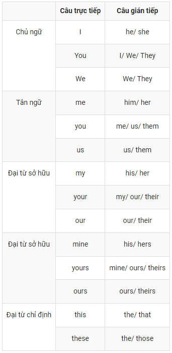
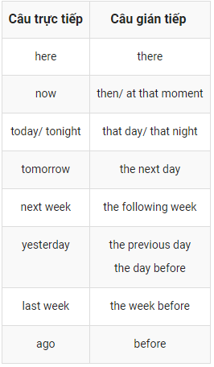

# Ngữ pháp

## [CÂU TRỰC TIẾP, CÂU GIÁN TIẾP (REPORTED SPEECH) TRONG TIẾNG ANH](#a)
### [I. KHÁI NIỆM](#a1)
### [II. CÁCH CHUYỂN CÂU TRỰC TIẾP SANG CÂU GIÁN TIẾP](#a2)
### [III. CÁC LOẠI CÂU TƯỜNG THUẬT](#a3)
### [IV. BÀI TẬP](#a4)

#

## <a id="a"></a> CÂU TRỰC TIẾP, CÂU GIÁN TIẾP (REPORTED SPEECH) TRONG TIẾNG ANH

### <a id="a1"></a> I. KHÁI NIỆM
Câu tường thuật là câu thuật lại lời nói trực tiếp.

**Lời nói trực tiếp (direct speech):** là nói chính xác điều ai đó diễn đạt (còn gọi là trích dẫn). <br> Lời của người nói sẽ được đặt trong dấu ngoặc kép.

Ví dụ: She said ,” The exam is difficult”. "The exam is difficult" là lời nói trực tiếp hay câu trực ti

**Lời nói gián tiếp – câu tường thuật (indirect speech):** Là thuật lại lời nói của một người <br> khác dưới dạng gián tiếp, không dùng dấu ngoặc kép.
Ví dụ: Hoa said,”I want to go home” -> Hoa said she wanted to go home là câu gián tiếp (indirect speech)

### <a id="a2"></a> II. CÁCH CHUYỂN CÂU TRỰC TIẾP SANG CÂU GIÁN TIẾP
Khi chuyển từ một lời nói trực tiếp sang gián tiếp khá đơn giản, chúng ta chỉ cần ghép nội dung <br> tường thuật ở phía sau câu nói và hạ động từ của nó xuống một cấp quá khứ, đại từ được <br> chuyển đổi cho phù hợp. Tuy nhiên, cần lưu ý một số vấn đề sau:

  - Nếu động từ tường thuật (reporting verb) chia ở các thì hiện tại chúng ta giữ nguyên thì <br>(tense) của động từ chính, đại từ chỉ định và các trạng từ chỉ nơi chốn cũng như trạng từ chỉ <br>thời gian trong câu trực tiếp khi chuyển sang gián tiếp.
  <br>**Ex :**
    - He says: “I’m going to Ha Noi next week.”
    - ⇒ He says he is going to Ha Noi next week.

  - Nếu động từ tường thuật (reporting verb) của câu ở thì quá khứ thì phải lùi động từ chính về <br> quá khứ một bậc khi chuyển từ lời nói trực tiếp (direct speech) sang lời nói gián tiếp <br>(indirect / reported speech) theo quy tắc sau:
  
    **Biến đổi thì của động từ và động từ khuyết thiếu theo bảng sau:**
    |    Câu trực tiếp                |    Câu gián tiếp            |
    | ---------------------------     | --------------------------- |
    |    Present simple               |    Past simple
    |    Present continuous           |    Past continuous
    |    Present perfect              |    Past perfect
    |    Past simple                  |    Past perfect
    |    Present perfect continuous   |    Past perfect continuous
    |    Past continuous              |    Past perfect continuous
	  |    will                         |    would
    |    can                          |    could
    |    must/ have to                |    had to
    |    may                          |    might
    
    **Biến đổi đại từ và các từ hạn định theo bảng sau:** <br>

    

    **Biến đổi trạng ngữ chỉ thời gian và nơi chốn theo bảng sau:** <br>

    

### <a id="a3"></a> III. CÁC LOẠI CÂU TƯỜNG THUẬT

1. Câu tường thuật ở dạng câu kể
    ```sh
      S + say(s)/said + (that) + S + V
    ```
  - says/say to + O -> tells/tell + O
  - said to + O ->told+O

    Eg: He said to me”I haven’t finished my work” -> He told me he hadn’t finished his work.

2. Câu tường thuật ở dạng câu hỏi

    a.Yes/No questions:
    ```sh
      S+asked/wanted to know/wondered+if/wether+S+V
    ```
    
    Ex: ”Are you angry?”he asked -> He asked if/whether I was angry.

    b.Wh-questions:
    ```sh
      S + asked(+O)/wanted to know/wondered + Wh-words + S + V.
    ```
    * says/say to + O  -> asks/ask + O
    
    * said to + O  -> asked + O.
    
    Ex: ”What are you talking about?”said the teacher. -> The teacher asked us what we were talking about.
    
3. Câu tường thuật ở dạng câu mệnh lệnh

    ***Khẳng định: S + told + O + to-infinitive.** <br>
    Ex: ”Please wait for me here, Mary. <br>
    ”Tom said -> Tom told Mary to wait for him there. <br>
    ***Phủ định: : S + told + O + not to-infinitive.**
    Ex: ”Don’t talk in class”,the teacher said to us. –>The teacher told us not to talk in class.
    
    Một số dạng câu tường thuật đặc biệt <br>
    -> **SHALL/ WOULD dùng để diễn tả đề nghị, lời mời:** <br>
    Tom asked: 'Shall I bring you some tea?' <br>
     -> Tom offered to bring me some tea. <br>
    Tom asked: 'Shall we meet at the theatre?' <br>
     -> Tom suggested meeting at the theatre. <br>
    
    -> **WILL/ WOULD/ CAN/ COULD dùng để diễn tả sự yêu cầu:** <br>

    Tom asked: 'Will you help me, please?' <br>
     -> Tom asked me to help him. <br>
    Jane asked Tom: 'Can you open the door for me, Tom?' <br>
     -> Jane asked Tom to open the door for her. <br>

### <a id="a4"></a> IV. BÀI TẬP

**Bài 1: Hoàn thành các câu sau.**

1. "Where is my umbrella?" she asked. <br>
She asked............................................. ......................

2. "How are you?" Martin asked us. <br>
Martin asked us................................................ ...................

3. He asked, "Do I have to do it?" <br>
He asked............................................. ......................

4. "Where have you been?" the mother asked her daughter. <br>
The mother asked her daughter.......................................... .........................

5. "Which dress do you like best?" she asked her boyfriend. <br>
She asked her boyfriend......................................... ..........................

6. "What are they doing?" she asked. <br>
She wanted to know.............................................. .....................

7. "Are you going to the cinema?" he asked me. <br>
He wanted to know.............................................. .....................

8. The teacher asked, "Who speaks English?" <br>
The teacher wanted to know.............................................. .....................

9. "How do you know that?" she asked me. <br>
She asked me................................................ ...................

10. "Has Caron talked to Kevin?" my friend asked me. <br>
My friend asked me................................................ ...................

11. "What's the time?" he asked.
<br> → He wanted to know .................................................. .

12. "When will we meet again?" she asked me.
<br> → She asked me .................................................. .

13. "Are you crazy?" she asked him.
<br> → She asked him .................................................. .

14. "Where did they live?" he asked.
<br> → He wanted to know .................................................. .

15. "Will you be at the party?" he asked her.
<br> → He asked her .................................................. .

16. "Can you meet me at the station?" she asked me.
<br> → She asked me .................................................. .

17. "Who knows the answer?" the teacher asked.
<br> → The teacher wanted to know .................................................. .

18. "Why don't you help me?" she asked him.
<br> → She wanted to know .................................................. .

19. "Did you see that car?" he asked me.
<br> → He asked me .................................................. .

20. "Have you tidied up your room?" the mother asked the twins.
<br> → The mother asked the twins .................................................. 

21. "Stop talking, Joe," the teacher said.
<br> → The teacher told Joe .................................................. .

22. "Be patient," she said to him.
<br> → She told him .................................................. .

23. "Go to your room," her father said to her.
<br> → Her father told her .................................................. .

24. "Hurry up," she said to us.
<br> → She told us .................................................. .

25. "Give me the key," he told her.
<br> → He asked her .................................................. .

26. "Play it again, Sam," she said.
<br> → She asked Sam .................................................. .

27. "Sit down, Caron" he said.
<br> → He asked Caron .................................................. .

28. "Fill in the form, Sir," the receptionist said.
<br> → The receptionist asked the guest .................................................. .

29. "Take off your shoes," she told us.
<br> → She told us .................................................. .

30. "Mind your own business," she told him.

<br> → She told him .................................................. .

31. "Don't touch it," she said to him.
<br> → She told him .................................................. .

32. "Don't do that again," he said to me.
<br> → He told me .................................................. .

33. "Don't talk to me like that," he said.
<br> → He told her .................................................. .

34. "Don't repair the computer yourself," she warned him.
<br> → She warned him .................................................. .

35. "Don't let him in," she said.
<br> → She told me .................................................. .

36. "Don't go out without me," he begged her.
<br> → He begged her .................................................. .

37. "Don't forget your bag," she told me.
<br> → She told me .................................................. .

38. "Don't eat in the lab," the chemistry teacher said.
<br> → The chemistry teacher told his students .................................................. .

39. "Don't give yourself up," he advised her.
<br> → He advised her .................................................. .

40. "Don't hurt yourselves, boys," she said.
<br> → She told the boys .................................................. .

**Bài 2: Bài tập câu tường thuật pha trộn negative và positive**

1. She said, "Go upstairs."
<br> → She told me .................................................. .

2. "Close the door behind you," he told me.
<br> → He told me .................................................. .

3. "Don't be late," he advised us.
<br> → He advised us .................................................. .

4. "Stop staring at me," she said.
<br> → She told him .................................................. .

5. "Don't be angry with me," he said.
<br> → He asked her .................................................. .

6. "Leave me alone," she said.
<br> → She told me .................................................. .

7. "Don't drink and drive," she warned us.
<br> → She warned us .................................................. .

8. "John, stop smoking," she said.
<br> → She told John .................................................. .

9. "Don't worry about us," they said.
<br> → They told her .................................................. .

10. "Meet me at the cinema." he said.
<br> → He asked me .................................................. .

11. He said, "I like this song."
<br> → He said .................................................. .

12. "Where is your sister?" she asked me.
<br> → She asked me .................................................. .

13. "I don't speak Italian," she said.
<br> → She said .................................................. .

14. "Say hello to Jim," they said.
<br> → They asked me .................................................. .

15. "The film began at seven o'clock," he said.
<br> → He said that .................................................. .

16. "Don't play on the grass, boys," she said.
<br> → She told .................................................. .

17. "Where have you spent your money?" she asked him.
<br> → She asked him .................................................. .

18. "I never make mistakes," he said.
<br> → He said .................................................. .

19. "Does she know Robert?" he wanted to know.
<br> → He wanted .................................................. .

20. "Don't try this at home," the stuntman told the audience.
<br> → The stuntman advised .................................................. .

21. "I was very tired," she said.
<br> → She said .................................................. .

22. "Be careful, Ben," she said.
<br> → She told .................................................. .

23. "I will get myself a drink," she says.
<br> → She said .................................................. .

24. "Why haven't you phoned me?" he asked me.
<br> → He wondered .................................................. .

25. "I cannot drive them home," he said.
<br> → He said .................................................. .

26. "Peter, do you prefer tea or coffee?" she says.
<br> → She asked .................................................. .

27. "Where did you spend your holidays last year?" she asked me.
<br> → She asked .................................................. .

28. He said, "Don't go too far."
<br> → He advised her .................................................. .

29. "Have you been shopping?" he asked us.
<br> → He wanted .................................................. .

30. "Don't make so much noise," he says.
<br> → He asked .................................................. .

ĐÁP ÁN

Bài 1:

She asked me where her umbrella was.

Martin asked us how we were.

He asked if he had to do it.

The mother asked her daughter where she had been.

She asked her boyfriend which dress he liked best.

She wanted to know what they were doing.

He wanted to know if I was going to the cinema.

The teacher wanted to know who spoke English.

She asked me how I knew that.

My friend asked me if Caron had talked to Kevin.

He wanted to know what time it was.

She asked me when we would meet again.

She asked him if he was crazy.

He wanted to know where they had lived.

He asked her if she would be at the party.

She asked me if I could meet her at the station.

The teacher wanted to know who knew the answer.

She wanted to know why he didn’t help her.

He asked me if I had seen that car.

The mother asked the twins if they had tidied up their room.

The teacher told Joe to stop talking.

She told him to be patient.

Her father told her to go to her room.

She told us to hurry up.

He asked her to give him the key.

She asked Sam to play it again.

He asked Caron to sit down.

The receptionist asked the guest to fill in the form.

She told us to take off our shoes.

She told him to mind his own business.

She told him not to touch it.

He told me not to do that again.

He told her not to talk to him like that.

She warned him not to repair the computer himself.

She told me not to let him in.

He begged her not to go out without him.

She told me not to forget my bag.

The chemistry teacher told his students not to eat in the class.

He advised her not to give herself up.

She told the boys not to hurt themselves.

Bài 2:

She told me to go upstairs.

He told me to close the door behind me.

He advised us not to be late.

She told him to stop staring at her.

He asked her not to be angry with him.

She told me to leave her alone.

She warned us not to drink and drive.

She told John to stop smoking.

They told her not to worry about them.

He asked me to meet him at the cinema.

He said that he liked that song.

She asked me where my sister was.

She said that she didn’t speak Italian.

They asked me to say hello to Jim.

He said that the film began at seven o’clock.

She told the boys not to play on the grass.

She asked him where he had spent his money.

He said that he never made mistakes.

He wanted to know if she knew Robert.

The stuntman advised the audience not to try that at home.

She said that she had been very tired.

She told Ben to be careful.

She said she would give herself a drink.

He wondered why she hadn’t phoned him.

He said that he could not drive them home.

She asked Peter if he preferred tea or coffee.

She asked me where I had spent my holidays the previous year.

He advised her not to go too far.

He wanted to know if we had been shopping.

He asked us not to make so much noise.